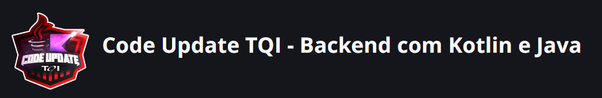

# dio-tqi-java-kotlin-bootcamp-2023
#### A Java-Kotlin Backend Bootcamp sponsored by @tqi and  @digitalinnovationone
```
Disclaimer
Esse repositório destina-se ao acompanhamento da minha evolução no Bootcamp de Java e Kotlin para
Backend patrocinado pela TQI em parceria com a DIO. As aula de cada tópico estudado foram colocadas
em um arquivo separado para facilitar consultas posteriores. Todos os conteúdos refletem meu
entendimento pessoal sobre cada tópico, podendo haver incorreções.

This repository is intended to monitor my evolution in TQI Backend Code Update in Java/Kotlin Bootcamp 
sponsored by TQI in partnership with DIO. The lessons of each topic studied were placed in a
separate file to facilitate later consultations. All contents reflect my personal understanding
of each topic, and there may be inaccuracies.
```

## Cursos do bootcamp

- ### Princípios de Desenvolvimento Ágil e Colaborativo
	- [Trabalhando em equipes Ágeis](./topics/TrabalhandoEmEquipesAgeis.md) ✅
	- [Versionamento de código com Git e Github](./topics/VersionamentocodigoGitGithub.md) ✅
	- [Desafios de projeto: Crie um portfolio vencedor](./topics/DesafioCodigoPortfolioVencedor.md) ✅
	- [Contribuindo em um projeto Open Source no GitHub](./topics/ContribuindoProjetoOpenSource.md) ✅
	- [Aula inaugural - Code Update TQI - Backend com Kotlin e Java](https://web.dio.me/live/aula-inaugural-code-update-tqi-backend-com-kotlin-e-java/learning/c10e727a-d700-497f-b1ae-d4fd259353ff?back=/track/code-update-tqi-backend-com-kotlin-e-java) ✅
	
- ### Desmistificando Kotlin para programadores Java
	- [Conhecendo o Kotlin e sua documentação oficial]() ✅
   	- [Introdução prática à linguagem de programação Kotlin](./topics/IntroducaoPraticaLinguagemKotlin.md) ✅
   	- [Estruturas de controle de fluxo e coleções em Kotlin](./topics/EstruturasControleFluxoColecoesKotlin.md) ✅
   	- [Orientação a Objetos e Tipos de Classes na prática com Kotlin](./topics/OrientacaoObjetoTipoClasse.md) ✅
   	- [O poder das funções em Kotlin](./topics/PoderFuncoesKotlin.md) ✅
   	- [Tratamento de exceções em Kotlin](./topics/TratamentoExcecoesKotlin.md) ✅
   	- [Abstraindo formações da DIO usando Orientação a Objetos com Kotlin]() 🧑🏻‍💻🛠️

- ### Explorando Padrões de Projetos na prática com Kotlin (Code Challenges)
  	- [Aperfeiçoe Sua Lógica e Pensamento Computacional](./topics/LogicaPensamento.md) ✅
   	- [Singleton](./topics/ChallengeSingleton.md) 🧑🏻‍💻🛠️
   	- [Builder](./topics/ChallengeBuilder.md)
	- [Adapter](./topics/ChallengeAdapter.md)
	- [Extension Function](./topics/ChallengeExtensionFunction.md)
	- [Processamento Paralelo / Assíncrono](./topics/ChallengeProcessamentoParalelo.md)
   	  
- ### Trabalhando com banco de dados SQL e NoSQL
- ### Ganhando produtividade com Java e Spring Boot
- ### Modernizando seu Backend com Kotlin e Spring Boot
