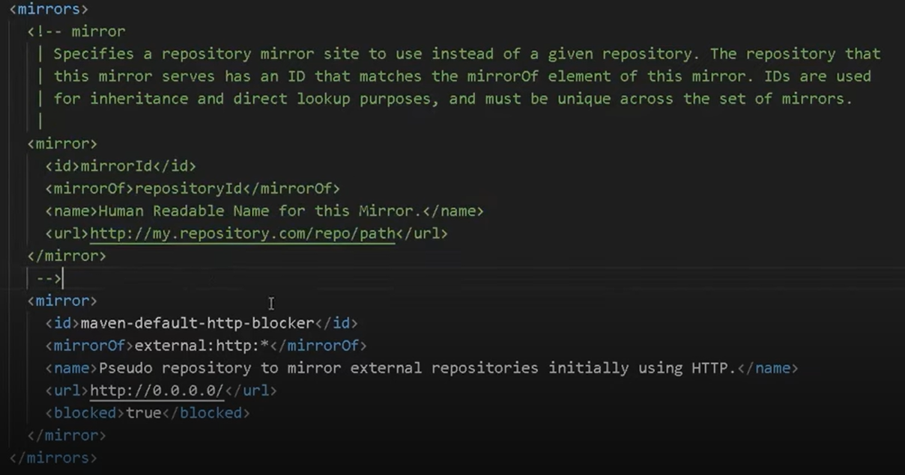
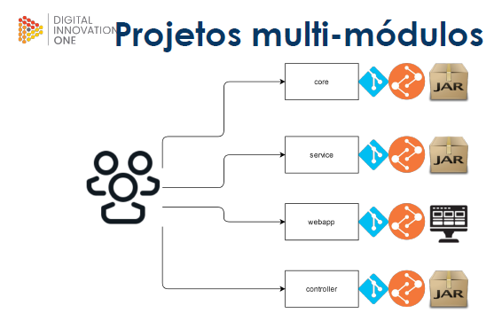
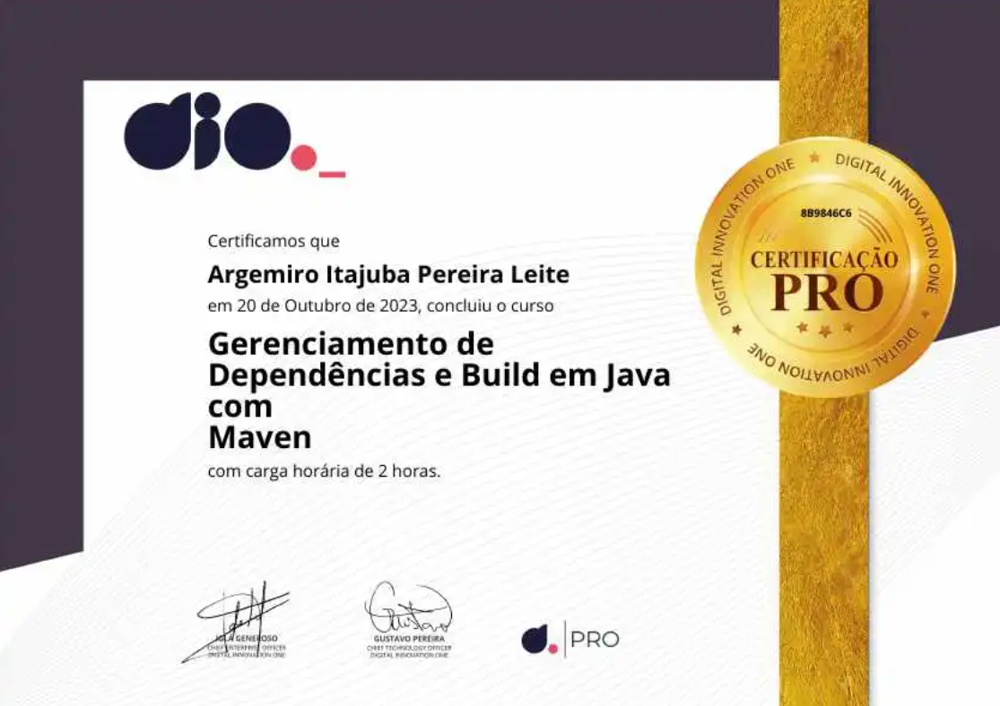

# Gerenciamento de Dependências e Build em Java com Maven

```
Bootcamp Code Update TQI Back End com Java e Kotlin
Módulo: Ganhando produtividade com Java e Spring Boot
Instrutor: Willyan Guimarães Caetano - 29/08/23 a 29/10/23
```

## Introdução

O Maven é uma ferramenta de gerenciamento de construção de projetos amplamente utilizada no desenvolvimento de software. Ela é projetada para simplificar o processo de compilação, distribuição e gerenciamento de dependências em projetos de software. O Maven é especialmente popular na comunidade de desenvolvimento Java, mas pode ser usado para projetos em outras linguagens de programação também.

## Definições

Com o Maven, os desenvolvedores podem definir a estrutura do projeto, suas dependências, tarefas de compilação e empacotamento em um arquivo de configuração chamado "pom.xml" (Project Object Model). O Maven então utiliza esse arquivo para automatizar tarefas como a compilação do código-fonte, a gestão de bibliotecas e a criação de artefatos, como arquivos JAR ou WAR.

```
O Maven foi desenvolvido pela Apache Software Foundation (Fundação Apache de Software), uma organização sem fins lucrativos que apoia o desenvolvimento de software de código aberto. Portanto, o Maven é um projeto de código aberto e é distribuído sob a Licença Pública Apache (Apache License), o que significa que é gratuito para uso e desenvolvimento, e os desenvolvedores têm a liberdade de modificar e distribuir o software de acordo com os termos da licença. 
```
## Instalação do Maven

**Pré-requisitos**:

Certifique-se de que você tenha o Java Development Kit (JDK) instalado em seu sistema. O Maven requer o JDK para funcionar.

Para verificar se existe uma versão do JDK instalado abra um terminal de comando e digite:

```shell
C:\Users\aiple>javac -version
javac 17.0.3.1
```

**Download do Apache Maven**:

- Acesse o site oficial do Apache Maven em [https://maven.apache.org/download.cgi](https://maven.apache.org/download.cgi).

- Escolha a versão desejada para download. Normalmente, você deve escolher a versão mais recente. Clique no link para baixar o arquivo compactado (ZIP ou TGZ).

**Extrair o Arquivo**:

Após o download, extraia o arquivo compactado para um diretório de sua escolha em seu sistema. Isso criará um diretório que contém todos os arquivos do Maven.

**Configurar Variáveis de Ambiente (Opcional, mas recomendado)**:

Para facilitar o uso do Maven, é uma boa prática configurar as variáveis de ambiente. No sistema Windows, você pode adicionar o caminho para a pasta bin do Maven (por exemplo, C:\caminho\para\maven\bin) na variável PATH. 

No Linux ou macOS, você pode editar o arquivo .bashrc, .bash_profile ou .zshrc para adicionar a configuração.

**Exemplo no Linux/macOS**:

```shell
export PATH=/caminho/para/maven/bin:$PATH
```

No **Windows**, você pode adicionar o caminho ao Maven nas variáveis de ambiente do sistema, seguindo as instruções apropriadas.

- Adicionar no Path pelo Painel Controle > Sistema e
Segurança > Sistema > Configurações avançadas do sistema >
Avançado > Variáveis de ambiente

**Verificar a Instalação**:

Abra um novo terminal ou prompt de comando e digite o seguinte comando para verificar se o Maven foi instalado corretamente:

```shell
mvn -version

C:\Users\aiple>mvn --version
Apache Maven 3.9.5 (57804ffe001d7215b5e7bcb531cf83df38f93546)
Maven home: C:\dev\apache-maven-3.9.5
Java version: 17.0.3.1, vendor: Oracle Corporation, runtime: C:\Program Files\Java\jdk-17.0.3.1
Default locale: pt_BR, platform encoding: Cp1252
OS name: "windows 11", version: "10.0", arch: "amd64", family: "windows"
```

## Primeiro projeto e conceitos

Nessa etapa iremos:
1. Entender como criar um projeto usando o Maven
2. Aprender alguns comandos que auxiliam no dia a dia
3. Criando diferentes tipos de projeto

### Criando um projeto via linha de comando

No nosso exemplo vamos criar um projeto Maven usando o arquétipo "maven-archetype-quickstart" via linha de comando. 

Vá para um diretório de trabalho, onde você irá criar seus projetos e copie o comando abaixo:

```shell
C:\Users\aiple>cd \dev\proj

C:\dev\proj>

C:\dev\proj>mvn archetype:generate -DgroupId=com.example -DartifactId=mymavenproject -DarchetypeArtifactId=maven-archetype-quickstart -DinteractiveMode=false
```

Este comando cria um projeto Maven simples usando o arquétipo "maven-archetype-quickstart". Aqui estão os detalhes dos parâmetros usados no comando:

- `DgroupId`: Especifique o groupId do seu projeto (URL ao contrário da organização)
- `DartifactId`: Especifique o artifactId do seu projeto (nome do projeto)
- `DarchetypeArtifactId`: Define o arquétipo que você deseja usar (neste caso, "maven-archetype-quickstart").
- `DinteractiveMode=false`: Isso desativa o modo interativo, para que o Maven não faça perguntas adicionais e use os valores fornecidos.

Depois de executar este comando, o Maven criará a estrutura do projeto com base nas informações fornecidas e você poderá começar a trabalhar no seu projeto Maven "maven-test-project" no diretório atual. 

Certifique-se de ajustar os valores de groupId e artifactId de acordo com as necessidades do seu projeto.


**Estrutura criada**

```shell
maven-test-project/
├── src/
│   ├── main/
│   │   ├── java/
│   │   │   └── com/
│   │   │       └── example/
│   │   │           └── mymavenproject.java
│   │   └── resources/
│   │       └── application.properties
│   └── test/
│       ├── java/
│       │   └── com/
│       │       └── example/
│       │           └── mymavenprojecttest.java
│       └── resources/
│           └── application-test.properties
├── target/
├── pom.xml
└── README.txt
```
Aqui estão as descrições dos principais elementos na estrutura do projeto:

- **src/main/java**: Este é o diretório onde você coloca seus arquivos de código-fonte Java. O pacote base "com.example" é apenas um exemplo; você pode personalizá-lo de acordo com suas preferências.

- **src/main/resources**: Este diretório é destinado a recursos de aplicação, como arquivos de propriedades, XML ou qualquer outro recurso não Java que seu projeto possa utilizar.

- **src/test/java**: Neste diretório, você coloca seus arquivos de teste unitário Java. É uma prática comum criar testes correspondentes aos arquivos-fonte na estrutura do projeto.

- **src/test/resources**: Semelhante a src/main/resources, este diretório é usado para recursos de teste.

- **target**: Este diretório é criado durante o processo de construção e contém os artefatos gerados, como o arquivo JAR ou WAR do projeto.

- **pom.xml**: Este é o arquivo de configuração principal do Maven que define as dependências do projeto, plugins, configurações e outras informações importantes.

- **README.txt**: Um arquivo de texto com informações gerais sobre o projeto.

### Comandos que auxiliam no dia-a-dia

**mvn compile**:

O comando `mvn compile` é usado para compilar o código-fonte do seu projeto. Isso significa que o Maven irá traduzir seu código-fonte (escrito em Java ou em outra linguagem suportada) em bytecode. 

Os arquivos compilados são colocados no diretório `target/classes` do seu projeto. Isso prepara o código para ser executado ou empacotado em um formato distribuível.

**mvn package**:

O comando `mvn package` é usado para criar um pacote (geralmente um arquivo JAR, WAR ou EAR) que contém o código compilado, recursos e outras dependências do projeto. Este comando compila o código, gera o pacote e o coloca no diretório target do projeto. O tipo de pacote gerado depende do tipo de projeto (por exemplo, JAR para projetos Java, WAR para projetos web).

**mvn test**:

O comando `mvn test` é usado para executar os testes unitários definidos no projeto. Os testes unitários são escritos para verificar se partes específicas do código estão funcionando conforme o esperado. O Maven executará os testes e fornecerá informações sobre quantos testes passaram e quantos falharam. Os resultados dos testes também são geralmente apresentados no relatório de teste do Maven.

**mvn clean**:

O comando `mvn clean` é usado para limpar o diretório de construção do projeto, que geralmente é o diretório target. Isso exclui todos os arquivos e diretórios gerados durante o processo de compilação e empacotamento. É útil quando você deseja recriar o projeto a partir do zero, removendo todos os artefatos de construção antigos.


### Criando diferentes tipos de projetos

Há várias formas de criar um projeto usando o Maven. Uma delas é procurar na Internet repositórios com arquétipos prontos para atender diversas finalidades de projeto.

Para criar diferentes tipos de projeto podemos usar também  o `Maven archetype` que é um template. 

Usando o comando abaixo o Maven fará o download dos arquétipos necessários da localização especificada:

```shell
mvn archetype:generate
```

Nesse template é possível definir:

- versão de componentes
- quais componentes vão ser inseridos automaticamente
- organização de pacotes
- organização de arquivos

Outra forma seria encontrar um arquétipo mais próximo das suas necessidades: 

- Pesquise na internet por `maven archetype list` para encontrar a opção que faz mais sentido para seu cenário.

- Procure pelas instruções de execução do comando `mvn archetype`

Segue abaixo algum desses repositórios de templates:

**Repositório Central do Maven (Maven Central Repository)**: Este é o repositório padrão do Maven e contém uma grande variedade de arquétipos prontos para uso. Você pode procurar arquétipos diretamente no Maven Central Repository ou especificar arquétipos a partir dele.

**Repositório de Arquétipos do Apache (Apache Archetype Repository)**: O Apache mantém um repositório de arquétipos que inclui uma variedade de modelos de projetos úteis. Você pode encontrar mais informações sobre os arquétipos do Apache em [Apache Archetype](https://maven.apache.org/archetypes/).

**Spring Initializr**: O Spring Initializr é uma ferramenta online que permite gerar projetos Spring Boot com configurações específicas. Embora não seja um repositório de arquétipos no sentido tradicional, é uma maneira conveniente de criar projetos Spring Boot personalizados. Você pode acessá-lo em Spring Initializr.

**JHipster**: O `JHipster` é um gerador de aplicativos para criar aplicativos da web e móveis baseados em Spring Boot e Angular ou React. Ele oferece uma variedade de opções e personalizações e pode ser usado para criar rapidamente aplicativos complexos. Saiba mais em `JHipster`.

## POM, dependências e repositórios

### POM

O POM ou Project Object Model é um arquivo XML que descreve as configurações e dependências de um projeto. Características:

- Unidade fundamental de trabalho
- Formato XML
- Detalha o projeto
- Detalha como construir o projeto
- Maven sempre procura pelo pom.xml para realizar sua execução

### Informações contidas no arquivo POM

- Nome do projeto
- Dependências
- Módulos
- Configurações de build
- Detalhes do projeto (nome, descrição, licença, url)
- Configurações de ambiente (repositórios, tracking, profiles)
- etc

Exemplo de um arquivo POM.xml bem detalhado:

```xml
<?xml version="1.0" encoding="UTF-8"?>
<project xmlns="http://maven.apache.org/POM/4.0.0"
         xmlns:xsi="http://www.w3.org/2001/XMLSchema-instance"
         xsi:schemaLocation="http://maven.apache.org/POM/4.0.0 http://maven.apache.org/xsd/maven-4.0.0.xsd">
    <modelVersion>4.0.0</modelVersion>

    <!-- Informações gerais do projeto -->
    <groupId>com.example</groupId>
    <artifactId>meu-projeto</artifactId>
    <version>1.0.0</version>
    <name>Meu Projeto</name>
    <description>Uma breve descrição do meu projeto.</description>

    <!-- Configuração de empacotamento (por exemplo, JAR, WAR) -->
    <packaging>jar</packaging>

    <!-- Dependências do projeto -->
    <dependencies>
        <dependency>
            <groupId>org.springframework</groupId>
            <artifactId>spring-core</artifactId>
            <version>5.2.6.RELEASE</version>
        </dependency>
        <dependency>
            <groupId>com.google.guava</groupId>
            <artifactId>guava</artifactId>
            <version>30.1-jre</version>
        </dependency>
        <!-- Outras dependências aqui -->
    </dependencies>

    <!-- Plugins Maven -->
    <build>
        <plugins>
            <plugin>
                <groupId>org.apache.maven.plugins</groupId>
                <artifactId>maven-compiler-plugin</artifactId>
                <version>3.8.0</version>
                <configuration>
                    <source>1.8</source>
                    <target>1.8</target>
                </configuration>
            </plugin>
            <!-- Outros plugins aqui -->
        </plugins>
    </build>

    <!-- Outras configurações do projeto -->
</project>
```

### Repositórios

São locais onde podemos encontrar plugins e bibliotecas que o
Maven provê. Existem dois tipos: Remoto e Local.

**Repositório Remoto**

É o local central utilizado pelo Maven para buscar os artefatos. Configurado automaticamente pelo Super POM para utilizar o [Maven Central](https://repo.maven.apache.org/maven2/)

É possível configurar o Maven para usar esse repositório em um projeto através POM como na figura abaixo:


Outra possibilidade é configurar através do arquivo *settings.xml* localizado na pasta:

```shell
pasta_apache_maven/conf/settings.xml
```
Basta procurar no arquivo a seção `<mirrors>` e descomentar o código referente ao repositório desejado. Abaixo um exemplo do *settings.xml*:



**Repositório Local**

É o repositório estruturado na própria máquina utilizado pelo Maven para buscar os artefatos. Essa solução é uma estratégia de caching para agilizar a carga dos artefatos.

**Localização do repositório local**

    - Windows: `%USERPROFILE%\.m2\repository`

    - Linux: `$HOME/.m2/repository`

### Como adicionar dependências

Para adicionar dependências a um projeto Maven, você precisa editar o arquivo `pom.xml`, que é o arquivo de configuração do Maven para o seu projeto. Aqui estão os passos para adicionar dependências:

- Abra o arquivo `pom.xml` no seu projeto usando um editor de texto ou uma IDE.

- Dentro do arquivo `pom.xml`, você encontrará uma seção `<dependencies>`. Se não existir, você pode criá-la manualmente dentro da seção `<project>`:

```xml
<project>
    ...
    <dependencies>
        <!-- Dependências serão adicionadas aqui -->
    </dependencies>
    ...
</project>
```
- Para adicionar uma dependência, você deve incluir uma entrada `<dependency>` dentro da seção `<dependencies>`. Cada entrada `<dependency>` deve conter os seguintes elementos:

- `<groupId>`: O identificador do grupo da dependência.
- `<artifactId>`: O identificador do artefato da dependência.
- `<version>`: A versão da dependência que você deseja usar.

Aqui está um exemplo de como adicionar a dependência do Apache Commons Lang ao seu projeto:

```xml
<dependencies>
    <dependency>
        <groupId>org.apache.commons</groupId>
        <artifactId>commons-lang3</artifactId>
        <version>3.12.0</version>
    </dependency>
</dependencies>
```

Depois de adicionar as dependências desejadas, salve o arquivo `pom.xml`.

O Maven irá automaticamente baixar as dependências da Internet e as incluirá no seu projeto durante o processo de construção. Você pode executar comandos como `mvn compile` ou `mvn package` para que o Maven baixe e integre as dependências no seu projeto.

Lembre-se de que o Maven procura por dependências no repositório central por padrão. Se você precisar usar um repositório diferente, você pode configurá-lo no arquivo pom.xml na seção `<repositories>`.

Além disso, você pode especificar escopos diferentes para as dependências (por exemplo, compile, test, provided, etc.) com base nos requisitos do seu projeto.


## Gerenciando dependências

### Tipos de dependência

Existem dois tipos de dependência: 
- Direta: dependências declaradas no pom.xml
- Transitiva: dependências obrigatórias das dependências declaradas no pom.xml

**Dependência Direta**:

- Uma dependência direta é aquela que você explicitamente adiciona ao arquivo pom.xml do seu projeto. Isso significa que você lista a dependência diretamente no arquivo de configuração do Maven.

- Essas dependências são necessárias para o seu projeto funcionar e são essenciais para compilar e executar o código do seu projeto.

**Dependência Transitiva**:

- Uma dependência transitiva é uma dependência que não é adicionada explicitamente ao arquivo pom.xml do seu projeto, mas é necessária por uma dependência direta.

- Quando você adiciona uma dependência direta, o Maven verifica se essa dependência tem outras dependências necessárias para seu funcionamento. Essas dependências necessárias são chamadas de dependências transitivas.

- O Maven automaticamente resolve e baixa as dependências transitivas para você, garantindo que o ambiente de desenvolvimento e compilação seja completo e funcional.


### Transitividade e Escopo

No contexto do Maven, a transitividade e o escopo são dois conceitos importantes relacionados ao gerenciamento de dependências. Vamos explicar o significado de cada um deles e como o Maven lida com esses conceitos:

***Transitividade de Dependências***:

A transitividade de dependências refere-se à capacidade de uma dependência de "trazer consigo" outras dependências necessárias para seu funcionamento.

Quando você adiciona uma dependência direta ao seu projeto, essa dependência pode, por sua vez, depender de outras bibliotecas para funcionar corretamente. O Maven é responsável por identificar e resolver essas dependências transitivas.

O Maven segue o grafo de dependências, identificando todas as dependências necessárias para que seu projeto funcione corretamente, e automaticamente as baixa e as torna disponíveis.

***Escopo de Dependências***:

O escopo de dependências define a área ou o contexto em que uma dependência é necessária no ciclo de vida do projeto. Ele controla quando e como a dependência deve ser usada.

O Maven fornece vários escopos de dependências, sendo os mais comuns:

- **compile**: Esta é a dependência padrão. As dependências com este escopo estão disponíveis durante todas as fases do ciclo de vida do projeto, desde a compilação até a execução.

- **provided**: As dependências com este escopo são necessárias apenas durante o processo de compilação e não são empacotadas com o artefato resultante (geralmente, um JAR ou WAR).

- **runtime**: As dependências com este escopo são necessárias durante a execução, mas não são necessárias durante a compilação.

- **test**: Estas dependências são necessárias apenas durante a fase de testes, como bibliotecas de teste e mocks.

A definição de cada escopo de dependência é especificada no arquivo pom.xml do seu projeto Maven. Para atribuir um escopo a uma dependência, você utiliza o elemento `<scope>` dentro da seção `<dependency>` do arquivo pom.xml. 

Aqui está um exemplo de como definir o escopo de uma dependência:

```xml
<dependencies>
    <!-- Dependência com escopo "compile" (padrão) -->
    <dependency>
        <groupId>org.example</groupId>
        <artifactId>minha-dependencia</artifactId>
        <version>1.0.0</version>
        <!-- Escopo "compile" é o padrão, portanto, não é necessário especificá-lo -->
    </dependency>

    <!-- Dependência com escopo "provided" -->
    <dependency>
        <groupId>org.example</groupId>
        <artifactId>outra-dependencia</artifactId>
        <version>2.0.0</version>
        <scope>provided</scope>
    </dependency>

    <!-- Dependência com escopo "runtime" -->
    <dependency>
        <groupId>org.example</groupId>
        <artifactId>terceira-dependencia</artifactId>
        <version>3.0.0</version>
        <scope>runtime</scope>
    </dependency>

    <!-- Dependência com escopo "test" -->
    <dependency>
        <groupId>org.example</groupId>
        <artifactId>dependencia-teste</artifactId>
        <version>4.0.0</version>
        <scope>test</scope>
    </dependency>
</dependencies>
```

### Escopo especial 'System'

O escopo "system" no Maven é um escopo especial e relativamente raro que permite que você especifique uma dependência do sistema. 

Isso significa que você está informando ao Maven que a dependência não deve ser resolvida a partir dos repositórios Maven padrão, mas sim do sistema de arquivos local.

Esse escopo é geralmente usado quando você tem bibliotecas ou JARs que não estão disponíveis em repositórios Maven públicos, mas que estão presentes em uma localização específica do seu sistema.

Para usar o escopo "system" no Maven, você precisa adicionar a dependência no seu arquivo pom.xml e especificar o caminho para o arquivo JAR da dependência no seu sistema. Aqui está um exemplo de como fazê-lo:

```xml
<dependencies>
    <dependency>
        <groupId>com.example</groupId>
        <artifactId>minha-dependencia</artifactId>
        <version>1.0.0</version>
        <scope>system</scope>
        <systemPath>/caminho/para/o/arquivo/minha-dependencia.jar</systemPath>
    </dependency>
</dependencies>
```

### Dica sobre escopos, dependências opcionais e exclusions

***Verificação de escopos por linha de comando***

Use o comando Maven abaixo para acompanhar como estão configuradas as principais dependências do projeto:

```shell
mvn dependency:build-classpath –DincludeScope=compile
mvn dependency:build-classpath –DincludeScope=test
mvn dependency:build-classpath –DincludeScope=runtime
```

***Dependências opcionais***

Dependências opcionais são aquelas que o seu projeto pode usar, mas não são estritamente necessárias. Você pode especificar dependências opcionais para indicar que, se estiverem disponíveis, seu projeto pode tirar proveito delas, mas não falhará se não estiverem presentes.

Essas dependências são definidas com o atributo <optional> dentro da seção <dependency> do arquivo pom.xml. Exemplo:

```xml
<dependencies>
    <dependency>
        <groupId>org.example</groupId>
        <artifactId>minha-dependencia</artifactId>
        <version>1.0.0</version>
        <optional>true</optional>
    </dependency>
</dependencies>
```
***Exclusões (Exclusions)***

As exclusões permitem que você especifique quais transições de dependências devem ser ignoradas. Isso é útil quando você deseja evitar que uma dependência específica ou um conjunto de dependências seja incluído no seu projeto, mesmo que sejam transitivas.

As exclusões são definidas dentro da seção <dependency> e você pode listar as dependências que deseja excluir usando o elemento <exclusions>.

Como mencionado acima, isso é útil quando você enfrenta conflitos de dependências ou quando deseja evitar a inclusão de bibliotecas que não são compatíveis com o seu projeto.

```xml
<dependencies>
    <dependency>
        <groupId>org.example</groupId>
        <artifactId>dependencia-1</artifactId>
        <version>1.0.0</version>
        <exclusions>
            <exclusion>
                <groupId>org.unwanted</groupId>
                <artifactId>dependencia-indesejada</artifactId>
            </exclusion>
        </exclusions>
    </dependency>
</dependencies>
```

## Maven Build LifeCycle

O Maven Build Lifecycle (Ciclo de Vida de Construção do Maven) é um conjunto de etapas bem definidas que descrevem a ordem em que as ações de construção e gerenciamento de um projeto Maven são executadas. 

O ciclo de vida do Maven divide o processo de desenvolvimento de software em fases lógicas, cada uma com um conjunto de objetivos predefinidos. 

Cada fase é executada sequencialmente, permitindo que você automatize tarefas de compilação, teste, empacotamento e implantação em seu projeto.

O Maven Build Lifecycle é composto por três principais fases (ou ciclos):

1. ***Clean Lifecycle (Ciclo de Limpeza)***:

- Esta fase é responsável por limpar o ambiente de construção, removendo quaisquer artefatos de compilação antigos, como arquivos .class ou artefatos de compilações anteriores.

- O objetivo principal dessa fase é garantir que você comece com um ambiente de desenvolvimento limpo antes de compilar e construir novamente seu projeto.

- É composto por três fases: pre-clean, clean e post-clean.

2. ***Default Lifecycle (Ciclo Padrão)***:

- Este é o ciclo de vida principal da construção e é acionado quando você executa um comando como mvn compile, mvn test, mvn package, entre outros.
- Ele inclui várias fases (23), como validate, compile, test, package, install, e deploy. Cada fase é executada em ordem, permitindo que você compile, teste, empacote, instale e distribua seu projeto de acordo com as necessidades.

3. ***Site Lifecycle (Ciclo de Geração de Site)***:

- Este ciclo é responsável pela geração da documentação do projeto, como sites HTML, relatórios, e outros documentos.
- Ele inclui fases como pre-site, site, post-site, site-deploy, e permite a criação de uma documentação de projeto facilmente acessível e compreensível.
- Corresponde à fase de publicação do projeto.

## Projetos multi-módulos



Para minimizar a complexidade de se trabalhar com grandes projetos interligados, o Maven possibilita a criação de um projeto `multi-módulo`, onde um projeto `agregador`.

Projetos multi-módulos no Maven são projetos que consistem em vários subprojetos (ou módulos) agrupados em um único projeto principal. 

Cada subprojeto pode ter seu próprio código-fonte, recursos e configurações, mas eles são gerenciados coletivamente como parte de um único projeto maior.

### Benefícios de projetos multi-módulos no Maven

- **Divisão Lógica do Código**: Os módulos permitem dividir o código do projeto em partes lógicas, facilitando a compreensão e manutenção do código.

- **Reutilização de Código**: Os módulos podem compartilhar dependências e código comum, promovendo a reutilização e a modularização.

- **Gerenciamento de Dependências Simplificado**: O Maven gerencia automaticamente as dependências entre os módulos, tornando mais fácil garantir que cada módulo tenha acesso às dependências necessárias.

- **Construção, Teste e Implantação Coordernadas**: Você pode construir, testar e implantar todos os módulos de forma coordenada a partir do projeto principal.

### Como consturir um projeto multi-módulo

Para criar um projeto multi-módulo no Maven, você precisa de uma estrutura de diretórios específica e um arquivo pom.xml principal que lista os módulos. A estrutura de diretórios pode ser semelhante à seguinte:

```scss
meu-projeto/
    ├── módulo-1/
    │   ├── src/
    │   ├── pom.xml
    ├── módulo-2/
    │   ├── src/
    │   ├── pom.xml
    ├── pom.xml (Projeto principal)
```
O arquivo pom.xml do projeto principal inclui uma seção `<modules>` que lista os módulos do projeto:

```xml
<modules>
    <module>módulo-1</module>
    <module>módulo-2</module>
</modules>

```
### Criação de um projeto modular a partir da linha de comando

Vamos criar um projeto multi-módulo com os seguintes sub-módulos: core, service e controller.

1. Criar o projeto agregador

```shell
mvn archetype: generate -DgroupId=dio DartifactId=project-parent -Darchetype=maven-quick-start
```
2. Criar cada submódulo

```shell
mvn archetype: generate -DgroupId=dio DartifactId=core -Darchetype=maven-quick-start

mvn archetype: generate -DgroupId=dio DartifactId=controller -Darchetype=maven-quick-start

mvn archetype: generate -DgroupId=dio DartifactId=service -Darchetype=maven-quick-start
```
## Plugins

Plugins são componentes que estendem as funcionalidades do Maven. Eles são responsáveis por executar tarefas específicas durante o ciclo de construção do projeto, como compilação, empacotamento, geração de documentação, implantação e muito mais. 

- A maioria das funcionalidades são providas por plugins
- Estilo arquitetural para extensibilidade (criar seu próprio plugin)
- Escritos prioritariamente em Java e disponibilizados comumente como JARs

## Plugins mais utilizados

- eclipse
- jacoco
- ear
- war
- compile
- clean
- checkstyle
- javadoc

Para executar um plugin, você pode usar comandos Maven, como `mvn nome-do-plugin:nome-da-meta`. Por exemplo, para compilar um projeto, você pode usar o comando mvn compile para acionar o plugin de compilação.

A configuração de um plugin está sempre dentro de uma tag `<build>`como exemplificado abaixo:

```xml
<build>
    <plugins>
        <plugin>
            <groupId>org.apache.maven.plugins</groupId>
            <artifactId>nome-do-plugin</artifactId>
            <version>1.0.0</version>
            <executions>
                <execution>
                    <goals>
                        <goal>nome-da-meta</goal>
                    </goals>
                </execution>
            </executions>
        </plugin>
    </plugins>
</build>

```

## Conclusão

Foi um treinamento essencial ao entendimento de Frameworks que usam o Maven em backplane para gerenciamento de build. Os objetivos propostos de se ter uma visão geral do Maven foi plenamente atingida e será de grande utilidade no percurso do desenvolvedor Java/Kotlin.

Como crítica construtiva sugiro mais cuidado na apresentação do conteúdo utilizando fontes muito pequenas. Acompanhar por dispostitivo como celulares e até tablets torna-se muito difícil senão impossível mesmo em alta definição. 

## Referências

**Apache Maven**
- [Ciclo de vida Maven](https://medium.com/@andgomes/os-ciclos-de-vida-do-maven-cefc18ba8ff3)
- [Introduction to Maven LifeCycle](https://maven.apache.org/guides/introduction/introduction-to-the-lifecycle.html)
- [Lifecycle Reference](https://maven.apache.org/guides/introduction/introduction-to-the-lifecycle.html#Lifecycle_Reference)
- [Plugins do Maven](https://www.baeldung.com/maven-site-plugin)
- [Metas e fases do Maven](https://www.baeldung.com/maven-goals-phases)

**Multi-módulos**

- [Multi-modules](https://www.baeldung.com/maven-multi-module)
- [Maven Guides Multi-Modules](https://maven.apache.org/guides/mini/guide-multiple-modules.html)


**Plugins**

- [Apache Maven Plugins](https://maven.apache.org/plugins/)
- [Apache Guides Plugin Introduction](https://maven.apache.org/guides/introduction/introduction-to-plugins.html)

## Certificado


```
Disclaimer:

Todo o material aqui apresentado foi gerado a partir de minhas anotações 
de aula durante o excelente treinamento ministrado  pelo Instrutor
Willyan Guimarães Caetano. Proibida a reprodução e veiculação sem ciência e 
autorização da DIO e do autor.
```
