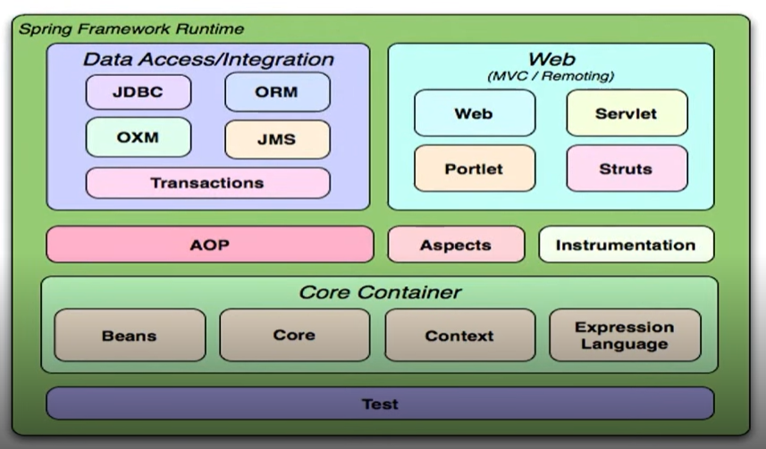
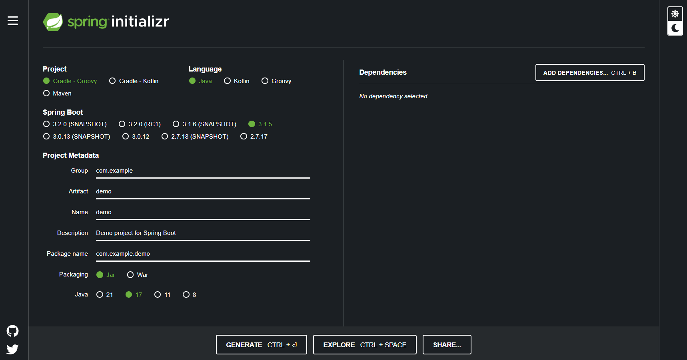
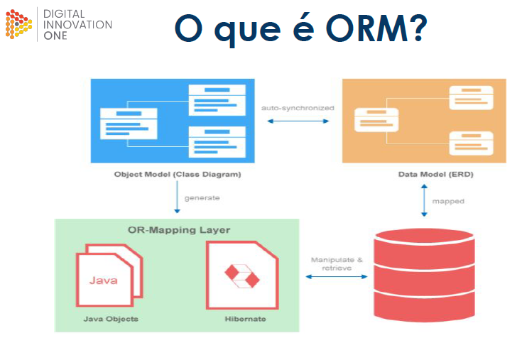
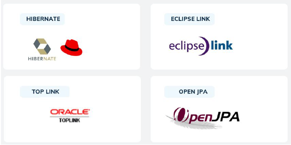
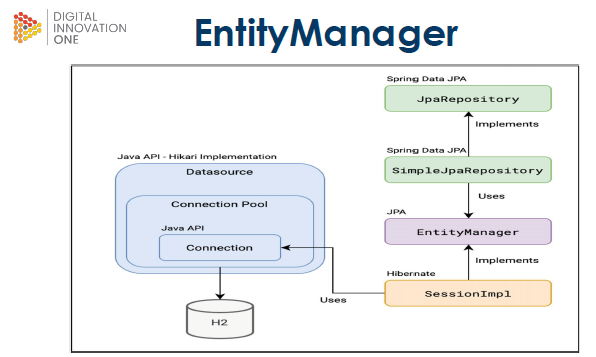

# Imersão no Spring Framework com Spring Boot

```
Bootcamp Code Update TQI Back End com Java e Kotlin
Módulo: Ganhando produtividade com Java e Spring Boot
Instrutor: Gleyson Sampaio - 29/08/23 a 29/10/23
```

## Índice

- [Visão geral do curso](#visão-geral-do-curso)
- [Spring Framework - Fundamentos](#spring-framework---fundamentos)
- [Conhecendo o Spring Boot](#conhecendo-o-spring-boot)
- [Primeiros passos](#primeiros-passos)
- [Beans versus Components](#beans-versus-components)
- [Scopes: Singleton ou Prototype](#scopes-singleton-ou-prototype)
- [Properties value: applicaton.properties](#properties-value)
- [Configuration properties](#configuration-properties)
- [Conceito de ORM e JPA](#conceito-de-orm-e-jpa)
- [Spring Data JPA](#spring-data-jpa)
- [Conexão com Postgres](#conexão-com-postgres)
- [JPA Repository](#jpa-repository)
- [Referências](#referencias)


### Visão geral do curso

Nesse curso serão abordados os seguintes tópicos:

- O que é Spring Framework
- Spring Versus `Java EE`
- Conceito de Inversão de Controle
- Injeção de Dependências
- Beans \ Autowired \ Scopes

### Spring Framework - Fundamentos e conceitos

#### O que é Spring Framework ?

É um framework `open-source` de desenvolvimento de aplicativos Java que fornece uma abordagem abrangente e modular para criar aplicativos empresariais. Ele foi criado para simplificar o desenvolvimento de aplicativos Java, tornando-o mais eficiente, produtivo e robusto.

Aqui estão alguns dos principais conceitos e funcionalidades do Spring Framework:

- **Inversão de Controle (IoC)**: O Spring Framework implementa o `Princípio de Inversão de Controle`, onde o controle da criação e gerenciamento de objetos é transferido do código do aplicativo para o próprio Spring. Isso promove a modularidade e a flexibilidade no desenvolvimento de aplicativos.

- **Injeção de Dependência (DI)**: O Spring suporta a `Injeção de Dependência`, permitindo que os componentes do aplicativo recebam suas dependências (ou colaboradores) de forma desacoplada, facilitando a criação e teste de unidades de código.

- **Aspect-Oriented Programming (AOP)**: O Spring fornece recursos para programação orientada a aspectos, permitindo que você defina aspectos (cross-cutting concerns) como segurança, transações e logging de forma modular e reutilizável.

- **Módulos:** O Spring Framework é modular e consiste em vários módulos, como Spring Core Container, Spring Data Access/Integration, Spring Web, Spring AOP e muito mais. Isso permite que você escolha os módulos relevantes para o seu projeto.

- 

- **Suporte a Transações**: O Spring oferece suporte a transações declarativas e programáticas, permitindo que você gerencie transações de maneira consistente e eficiente em seu aplicativo.

- **Segurança**: O Spring fornece recursos abrangentes de segurança, permitindo a configuração de autenticação e autorização em seus aplicativos.

- **Integração com Frameworks e Tecnologias**: O Spring é altamente adaptável e pode ser integrado com facilidade a outras tecnologias e frameworks, como Hibernate, JPA, JDBC, REST, SOAP, e muito mais.

- **Suporte a Web**: O Spring oferece um conjunto de recursos para o desenvolvimento de aplicativos da web, incluindo um modelo de programação baseado em MVC (Model-View-Controller), gerenciamento de sessões, segurança e muito mais.

```
⚠️ O ecossistema Spring também inclui vários projetos relacionados, como o Spring Boot, Spring Security, Spring Data e outros, que estendem as capacidades do Spring para atender a diferentes necessidades de desenvolvimento de aplicativos.
```

- **Bean**: É todo objeto criado e gerenciado por um `container` através do princípio da Inversão de Controle (IoC).

- **Scopes**: Existem dois tipos de escopos categorizados para o paradigma Stand-alone (Singleton e Prototype) e três tipos para HTTP (Request, Session e Global). 

    - Singleton: é um escopo onde se tem um único objeto compartilhado por toda a aplicação.

    - Prototype: nesse escopo uma nova instância será criada a cada solicitação de um objeto ao container.

    - HTTP-Request: nesse escopo um bean será criado para cada requisição HTTP. 

    - HTTP-Session: nesse escopo um bean será criado para cada sessão de usuário. 

    - HTTP-Global: é um escopo que cria um  bean para tratar o ciclo de vida do contexto da aplicação.

- **Autowired**: é uma *annotation* que informa onde deverá ocorrer uma injeção automática de dependência.

### Spring versus Java EE

O Spring Framework e o `Java EE` (Java Platform, Enterprise Edition) são dois conjuntos de tecnologias amplamente utilizados no desenvolvimento de aplicativos empresariais em Java. 

Ambos têm como objetivo simplificar o desenvolvimento de aplicativos empresariais, mas têm abordagens e históricos diferentes. 


Vamos comparar as duas arquiteturas sob alguns aspectos:

***Filosofia de Design***:

**Spring**: O `Spring` segue o princípio de Inversão de Controle (IoC) e Injeção de Dependência (DI), enfatizando a desacoplagem e modularidade. Ele permite que você escolha quais módulos e funcionalidades do `Spring` deseja usar em seu projeto.

**Java EE**: O `Java EE` oferece um conjunto de especificações e APIs definidas que as implementações devem seguir. Ele fornece um conjunto mais rígido de padrões e, por vezes, pode ser percebido como mais pesado do que o `Spring`.


***Arquitetura***:

**Spring**: O `Spring` é frequentemente usado em combinação com servidores de aplicativos `Java EE`, mas também pode ser executado de forma autônoma. Ele fornece uma variedade de funcionalidades, incluindo IoC, DI, segurança, AOP e suporte a transações.

**Java EE**: O `Java EE` fornece um ambiente de execução de servidor completo, que inclui funcionalidades como EJB (Enterprise JavaBeans), JMS (Java Message Service), JPA (Java Persistence API) e outras, tornando-o uma opção abrangente para aplicativos empresariais.

***Flexibilidade e Modularidade***:

**Spring**: O `Spring` permite que você escolha quais partes do framework deseja usar e integre-as com outras tecnologias Java, como Hibernate e JPA. Isso oferece grande flexibilidade e modularidade.

**Java EE**: O `Java EE` é mais monolítico em comparação com o `Spring`, com um conjunto de especificações que você precisa seguir. Isso pode ser uma vantagem para garantir a conformidade, mas pode limitar a flexibilidade em certos cenários.

***Comunidade e Ecossistema***:

**Spring**: O `Spring` tem uma comunidade de desenvolvedores muito ativa e um grande ecossistema de projetos relacionados, como o `Spring` Boot, `Spring` Security e `Spring` Data.

**Java EE**: O `Java EE` é mantido pela Oracle e possui várias implementações, incluindo o GlassFish e o WildFly (anteriormente JBoss). Apesar disso, sua adoção tem diminuído em favor de alternativas como o `Spring`.

***Adoção e Tendências***:

**Spring**: O `Spring` é amplamente adotado e é uma escolha popular para o desenvolvimento de aplicativos empresariais em Java. Projetos como o `Spring` Boot têm impulsionado ainda mais sua popularidade.

**Java EE**: Embora o `Java EE` ainda seja usado em muitos cenários empresariais, ele perdeu parte de sua relevância nos últimos anos, à medida que desenvolvedores e empresas adotaram abordagens mais leves e flexíveis, como o `Spring`

## Projeto Spring Boot

### Conhecendo o Spring Boot

O Spring Boot é um projeto dentro do ecossistema do Spring Framework que tem como objetivo simplificar significativamente o desenvolvimento de aplicativos Java. Ele fornece um conjunto de ferramentas e convenções para facilitar a criação de aplicativos autônomos, prontos para produção, com configuração mínima.

### Principais características do Spring Boot

- **Simplificação de Configuração**: Uma das características mais marcantes do Spring Boot é sua capacidade de reduzir a configuração. Ele fornece valores padrão sensatos para muitas configurações, permitindo que você inicie um aplicativo com o mínimo de configuração. Isso é possível graças ao mecanismo de "convenção sobre configuração" do Spring Boot.

- **Embutimento de Servidor**: O Spring Boot inclui servidores da web incorporados, como o Tomcat, Jetty ou Undertow. Isso significa que você pode criar aplicativos que são executados diretamente a partir de um arquivo JAR, tornando a implantação mais simples.

- **Prontidão para Produção**: O Spring Boot promove boas práticas de desenvolvimento e oferece recursos como métricas, monitoramento e gerenciamento de propriedades, tornando seus aplicativos prontos para produção.

- **Suporte para Diversos** Tipos de Aplicativos: O Spring Boot é versátil e pode ser usado para desenvolver aplicativos da web, serviços REST, aplicativos para microserviços, aplicativos de processamento de lotes e muito mais.

- **Integração com o Ecossistema Spring**: O Spring Boot é compatível com todo o ecossistema Spring, o que significa que você pode aproveitar todas as funcionalidades do Spring Framework, como Injeção de Dependência (DI) e Spring Data, em seus aplicativos Spring Boot.

- **Facilidade de Testes**: O Spring Boot simplifica os testes de unidade e integração, facilitando a configuração de ambientes de teste.

- **Comunidade Ativa**: O Spring Boot possui uma comunidade de desenvolvedores ativa e uma ampla documentação, tornando-o uma escolha popular para o desenvolvimento de aplicativos Java.

- ⚠️ Enquanto o Spring Framework é baseado no padrão de injeção de dependências, o Springboot foca na configuração automática.


#### Starters

Starters são descritores de dependências, cujos benefícios são:

- Coesão
- Compatibilidade de versões
- Otimização do tempo
- Simplificação de configuração
- Foco no negócio

O *starters* aparecem no arquivo de configuração de projeto `pom.xml` conforme abaixo:

```xml
<dependencies>
		<dependency>
			<groupId>org.springframework.boot</groupId>
			<artifactId>spring-boot-starter-data-jpa</artifactId>
		</dependency>
		<!-- POSTGRES -->
		<dependency>
			<groupId>org.postgresql</groupId>
			<artifactId>postgresql</artifactId>
			<scope>runtime</scope>
		</dependency>
		<dependency>
			<groupId>org.springframework.boot</groupId>
			<artifactId>spring-boot-starter-web</artifactId>
		</dependency>
		<dependency>
			<groupId>org.springframework.boot</groupId>
			<artifactId>spring-boot-starter-test</artifactId>
			<scope>test</scope>
		</dependency>
	</dependencies>
```
#### Principais Starters

Abaixo estão os principais startes e sua aplicações:

- data-jpa: Integração a banco de dados via JPA-Hibernate
- data-mongodb: Interação com banco de dados MongoDB.
- web: Inclusão do container Tomcat para aplicações REST.
- web-services: Webservices baseados na arquitetura SOAP.
- test: Disponibilização de recursos para testes unitários como JUnit
- openfeign: Client HTTP baseado em interfaces
- actuator: Gerenciamento de monitoramento da aplicação.
- batch: Implementação de Jobs de Processos


#### Configuração de fábrica

### Primeiros passos

#### Criando um projeto com initializr

É possível criar a estutrura de um projeto usando ferramentas como o Spring Initalizr que fica disponível no endereço: [https://start.spring.io/](https://start.spring.io/)

Basta fornecer as opções de projeto e clicar em [**Generate**]



Será gerado um arquivo compactado que deverá ser descompactado na pasta do seu projeto.

#### importando o projeto maven no IntelliJ

Após descompactação do projeto, abra a pasta usando o IDE de sua escolha. No exemplo usaremos a versão [Community Edition do IntelliJ Idea](https://www.jetbrains.com/idea/download/download-thanks.html?platform=windows&code=IIC) da Jet Brains.

#### Conhecendo a estrutura Spring Boot

Estrutura de pastas criada pelo Spring Initializr é mostrada abaixo:

```css
meu-projeto/
  ├── src/
  │   ├── main/
  │   │   ├── java/
  │   │   │   ├── pacote/
  │   │   │   │   ├── Application.java
  │   │   ├── resources/
  │   │   │   ├── application.properties
  │   ├── test/
  │   │   ├── java/
  │   │   │   ├── pacote/
  │   │   │   │   ├── ApplicationTest.java
  ├── target/
  ├── pom.xml

```
- **src/main/java/**: Esta pasta contém o código-fonte principal do seu aplicativo. Você escreverá suas classes Java e pacotes neste diretório. A classe Application.java é geralmente o ponto de entrada principal do seu aplicativo.

- **src/main/resources/**: Essa pasta contém recursos, como arquivos de propriedades de configuração, arquivos XML de configuração, modelos de visualização, arquivos estáticos, etc., que são usados pelo seu aplicativo principal.

- **src/test/java/**: Aqui, você coloca as classes de teste para seu aplicativo. O Spring Boot utiliza JUnit e outras bibliotecas para testes, e você pode escrever testes unitários e de integração nesta pasta.

- **target/**: Esta pasta é usada para armazenar arquivos compilados, artefatos de construção e outras saídas geradas durante o desenvolvimento e construção do projeto. Ela é criada automaticamente pelo Maven.

- **pom.xml**: Este é o arquivo de configuração do Maven para o seu projeto. Ele descreve as dependências, plugins e configurações do seu projeto. É usado para gerenciar as dependências do seu projeto e controlar o processo de construção.

- **application.properties**: Este arquivo de propriedades no diretório src/main/resources é usado para configurar propriedades do aplicativo, como configurações de banco de dados, portas do servidor e outras configurações personalizadas.

- **ApplicationTest.java**: Este é um arquivo de teste de exemplo no diretório src/test/java. Você pode escrever testes para seu aplicativo aqui.

#### Bean e CommandLineRunner

O arquivo `Application.java` em um projeto Spring Boot é geralmente o ponto de entrada principal do seu aplicativo e é onde a aplicação Spring Boot é configurada e inicializada. Vejamos seu código:

```java
package pacote;

import org.springframework.boot.SpringApplication;
import org.springframework.boot.autoconfigure.SpringBootApplication;

@SpringBootApplication
public class Application {

    public static void main(String[] args) {
        SpringApplication.run(Application.class, args);
    }
}
```
A anotação `@SpringBootApplication` é usada para marcar a classe como a classe principal de inicialização do aplicativo Spring Boot. Ela ativa várias configurações e recursos do Spring Boot, como o mecanismo de component scanning, configuração automática e outras.

O método `main()` é o ponto de entrada do aplicativo. Ele usa o `SpringApplication.run()` para iniciar o `conteiner` da aplicação Spring Boot. 

A classe `Application.class` é passada como argumento, indicando qual classe contém a configuração principal. A matriz args é usada para passar argumentos da linha de comando para o aplicativo, se necessário.

A aplicação acima compila sem erro, ms não tem nenhum comportamento. Para inserir um cálculo matemático, por exemplo, criamos uma classe Calculadoa conforme abaixo:

```java
package pacote;

public class Calculadora {
    public int somar(int numero1, int numero2){
        return numero1 + numero2;
    }
}
```
Para instanciar essa classe dentro do arquivo Application.java sem usar o método new() (que seria contrário ao padrão IoC) teremos que criar uma classe MyApp.java que seria responsável por acionar o nosso container criador de objetos. Isso para que o nosso código fique em acordo com a proposta do Spring de utilização do IoC e DI como elementos estruturais.

Para isso criaremos a classe MyApp.java conforme abaixo:

```java
package pacote;
import org.springframework.boot. CommandLineRunner;
import org.springframework.stereotype.Component;
import org.springframework.beans.factory.annotation.Autowired;

@Component
public class MyApp implements CommandLineRunner {

    @Autowired
    private Calculadora calculadora;

    @Override
    public void run(String ... args) throws Exceptions {
        System.out.println("O resultado da soma é :" + calculadora.somar(2,7));
    }
}
```
O código é uma classe Java que implementa a interface `CommandLineRunner` do Spring Boot. Essa interface é usada para executar código personalizado durante a inicialização de um aplicativo Spring Boot:

- A classe MyApp é declarada como pública e implementa a interface `CommandLineRunner`. Isso significa que a classe MyApp fornecerá uma implementação do método run definido pela interface CommandLineRunner.

- O método run é anotado com @Override, o que indica que ele está substituindo um método da interface CommandLineRunner. Esse método é chamado durante a inicialização do aplicativo Spring Boot.

- O método `run()` recebe um argumento String ... args, que é uma matriz de strings que pode conter argumentos da linha de comando. Você pode usar esses argumentos para configurar ou personalizar o comportamento do seu aplicativo durante a inicialização, se necessário.

- Dentro do método run(), você pode escrever o código personalizado que deseja executar durante a inicialização do aplicativo. Isso pode incluir tarefas como configuração, carregamento de dados iniciais, ou qualquer outra lógica específica do seu aplicativo.

A anotação `@Component` marca a classe MyApp como um componente gerenciado pelo Spring. Isso significa que o Spring irá detectar e gerenciar automaticamente a instância dessa classe, permitindo que você injete-a em outras partes do seu aplicativo e aproveite as funcionalidades de injeção de dependência do Spring.

Essa mesma `annotation` será usada na classe Calculadora. Assim a instanciação dos objetos a partir das classes MyApp e Calculadora será gerenciada pelo container (Spring Boot).

O código `@Autowired` é uma anotação do Spring Framework que é usada para realizar a injeção de dependência. Isso significa que o Spring irá automaticamente fornecer uma instância da classe Calculadora para o campo calculadora na classe MyApp.

A injeção de dependência é um conceito em que os componentes de um aplicativo dependem de outros componentes para funcionar. Em vez de criar manualmente uma instância de Calculadora na classe MyApp, você permite que o Spring faça isso por você, tornando seu código mais desacoplado e flexível.

O objetos assim gerados pelo container serão os `Beans`.

### Beans versus Components

- Quando usar @Bean ?
- Quando usar @Component?
- Implementar a IoC e DI

No contexto do Spring Framework e do Spring Boot, @Component e @Bean são duas anotações usadas para definir componentes gerenciados pelo contêiner de IoC (Inversão de Controle) do Spring. Ambas desempenham um papel importante na configuração e criação de objetos dentro do contexto de aplicação, mas existem diferenças fundamentais entre elas:

**@Component**:

- É uma anotação genérica que indica que a classe é um componente gerenciado pelo Spring.
- É usada principalmente para classes que não se encaixam em outras categorias específicas, como @Repository, @Service ou @Controller.
- Classes anotadas com @Component são identificadas automaticamente pelo mecanismo de varredura de componentes do Spring.
- São instanciadas e gerenciadas automaticamente pelo Spring, e você pode injetá-las em outras classes usando @Autowired ou outro mecanismo de injeção de dependência.

**@Bean**:

- É uma anotação usada para definir métodos que produzem objetos gerenciados pelo Spring.
- Geralmente é usado quando você deseja personalizar a criação de um bean de uma maneira que não pode ser alcançada apenas com a anotação @Component.
- Métodos anotados com @Bean retornam um objeto que é gerenciado pelo contêiner Spring.
- Você pode usar @Bean para configurar objetos de terceiros ou para criar beans com configuração personalizada.

`@Bean`: Você deve usar @Bean quando não tem acesso ao código-fonte da classe que deseja configurar como um bean gerenciado pelo Spring. Isso ocorre porque @Bean permite que você configure objetos de terceiros ou classes para as quais não pode adicionar anotações, personalizando a configuração do bean.

`@Component`: Por outro lado, quando você tem acesso ao código-fonte de uma classe e pode adicionar anotações do Spring a ela, como @Component, essa é a abordagem mais simples e natural. Use @Component quando a classe pode ser facilmente integrada ao conceito de injeção de dependência do Spring.

Em resumo:

Use @Bean quando não tiver acesso ao código fonte das classes a serem componentizadas e use @Component quando tiver acesso ao código-fonte de uma classe que tem a possibilidade de ser provida pelo conceito de injeção de dependências.

Portanto, a escolha entre @Bean e @Component depende em grande parte da acessibilidade ao código-fonte da classe que você deseja injetar no contêiner Spring. 

Se você tem acesso ao código-fonte, usar @Component é mais direto e geralmente preferível. 

Se não tem acesso ao código-fonte, ou se deseja uma configuração mais detalhada, recorra a @Bean para personalizar a criação e configuração do bean.

### Scopes: Singleton ou Prototype

Para indicar que uma classe é do tipo 'singleton' ou 'prototype' usa-se a *annotation* `@Scope("tipo_do_escopo")`, onde o tipo_do_escopo pode ser prototye, singleton etc.

Lembrando que um *Singleton* é um padrão de projeto onde uma classe deve ser instanciada uma única vez.

Por sua vez, *Prototype* gera várias instâncias de um classe conforme necessidade.

### Properties value

Nessa seção falaremos do arquivo de controle `application.properties`. 

Esse arquivo guardará informações referentes ao projeto, como valores de variáveis, tornando o código mais limpo, sem a atribuição de valores.

No trecho de código abaixo temos uma classe java `Componentizada`, onde os as  variáveis *nome*, *email* e *telefone* estão referenciada pelas *annotations* `@Value("${nome_variavel:valor default}")` e declaradas no arquivo de configuração `application.properties`.

Trecho da classe SistemaMensagem.java

```java
@Component
public class SistemaMensagem implements CommandLineRunner {
	@Value("${name:NoReply-DIO}")
	private String nome;
	@Value("${email}")
	private String email;
	@Value("${telefones}")
	private List<Long> telefones =
			new ArrayList<>(Arrays.asList(new Long[]{11956781254L}));

	@Override
	public void run(String... args) throws Exception {
		System.out.println("Mensagem enviada por: " + nome
				+ "\nE-mail:" + email
				+ "\nCom telefones para contato: " + telefones);
		System.out.println("Seu cadastro foi aprovado");
	}
}
```
Conteúdo do arquivo `application.properties`

```shell
nome=Digital Innovation One
email=noreply@dio.com.br
telefones=1145651725,1187651343
```

### Configuration properties

A anotação (ou *annotation*) `@ConfigurationProperties(prefix="prefix")` no Spring Boot é usada para vincular propriedades de configuração externas a objetos Java, tornando mais fácil a configuração de propriedades em seu aplicativo. 

Essa anotação é frequentemente usada em conjunto com arquivos de propriedades ou arquivos YAML para carregar configurações externas em classes de configuração.


### Conceito de ORM e JPA

#### ORM

Object-Relational Mapping, Em português, mapeamento objeto-relacional, é um recurso para aproximar o paradigma da
orientação a objetos ao contexto de banco de dados relacional.

O uso de ORM é realizado através do mapeamento de objeto para uma tabela por uma biblioteca ou framework.



#### Java Persistance API

JPA é uma especificação baseada em interfaces, que através de um framework realiza operações de persistência de objetos em Java. Existem várias implementações de JPA no mercado. O Hibernate é apenas uma delas;



#### Mapeamentos

Para implementar o mapeamento é imprescindíve:

- Que as classes tenham uma identificação

- Que existam atributos com os quais se possa realizar definições de cada campo. Essas definições estão diretamente relacionadas à DDL.

- Estabelecer o relacionamento entre as clsses-tabelas através de `annotations`.

- Implementar mecanismos onde a Herança possa ser representada no pradigma relacional. 

- Usar anotações que gerenciem a Persistência dos dados.

### Passos para implementação de mapeamento objeto-relacional com JPA

1. Defina sua Entidade: 
Crie uma classe Java para representar a entidade que você deseja mapear para uma tabela no banco de dados. Anote a classe com @Entity do JPA para indicar que é uma entidade.

```java
import javax.persistence.Entity;
import javax.persistence.GeneratedValue;
import javax.persistence.GenerationType;
import javax.persistence.Id;

@Entity
public class Produto {
    @Id
    @GeneratedValue(strategy = GenerationType.IDENTITY)
    private Long id;
    private String nome;
    private double preco;
    // Outros atributos e métodos
}

```
2. Configurar a Fonte de Dados:
No arquivo de configuração do Spring Boot (geralmente application.properties ou application.yml), configure as propriedades do banco de dados, como URL, nome de usuário e senha, como no exemplo anterior.

```properties
spring.datasource.url=jdbc:mysql://localhost:3306/meubanco
spring.datasource.username=usuario
spring.datasource.password=senha
spring.datasource.driver-class-name=com.mysql.cj.jdbc.Driver
```
3. Configurar o Hibernate:
O Hibernate é usado automaticamente pelo Spring Boot quando está no classpath. No entanto, você pode configurar opções adicionais, se necessário, no mesmo arquivo de configuração. Por exemplo:

```properties
spring.jpa.hibernate.ddl-auto=update
spring.jpa.properties.hibernate.dialect=org.hibernate.dialect.MySQL5Dialect
```
A propriedade spring.jpa.hibernate.ddl-auto determina como o Hibernate lida com a criação das tabelas no banco de dados. No exemplo, está configurado para atualizar automaticamente o esquema do banco de dados com base nas alterações no código das entidades.


4. Usando o EntityManager:
Para interagir com o banco de dados usando o Hibernate, você pode injetar o EntityManager em seus serviços ou controladores e usá-lo para realizar operações de CRUD, consultas JPQL, etc.


```java
import javax.persistence.EntityManager;
import javax.persistence.PersistenceContext;

@Service
public class ProdutoService {
    @PersistenceContext
    private EntityManager entityManager;

    public Produto salvarProduto(Produto produto) {
        entityManager.persist(produto);
        return produto;
    }
}

```
⚠️ Lembre-se de que, ao usar o Hibernate diretamente, você terá mais controle sobre as consultas e operações no banco de dados, mas também terá que lidar com detalhes de baixo nível em comparação com o Spring Data JPA, que abstrai muitos desses detalhes.

#### Entity Manager



O `EntityManager` é uma parte fundamental do Java Persistence API (JPA), que é uma especificação para mapeamento objeto-relacional em Java. Ele é responsável por gerenciar entidades em um contexto de persistência e facilitar a comunicação entre objetos Java e um banco de dados relacional. 

Aqui estão os principais pontos sobre o `EntityManager`:

***Gerenciamento de Entidades***:
O `EntityManager` é usado para criar, recuperar, atualizar e excluir entidades em um banco de dados. Ele gerencia o ciclo de vida das entidades, garantindo que elas estejam em sincronia com o banco de dados.

***Contexto de Persistência***:
O `EntityManager` cria um contexto de persistência, que é uma área temporária de memória em que as entidades são gerenciadas. As operações em entidades dentro desse contexto são automaticamente refletidas no banco de dados quando ocorre um commit ou uma operação de flush.

***Mapeamento Objeto-Relacional***:
O `EntityManager` é responsável por mapear entidades Java para tabelas no banco de dados e vice-versa. Ele utiliza anotações JPA ou arquivos de mapeamento XML para definir como as entidades se relacionam com as tabelas.

***Consulta***:
O `EntityManager` permite a execução de consultas JPQL (Java Persistence Query Language) para recuperar dados do banco de dados de forma orientada a objetos. Isso torna mais fácil e flexível a recuperação de informações.

***Transações***:
O `EntityManager` trabalha em conjunto com as transações. As operações de persistência geralmente ocorrem dentro de transações, que garantem a atomicidade, consistência, isolamento e durabilidade (propriedades ACID) das operações no banco de dados.

***APIs JPA e Implementações***:
A especificação JPA define uma API padrão que o `EntityManager` segue. Diferentes implementações, como o Hibernate e o EclipseLink, fornecem a funcionalidade real do `EntityManager` de acordo com a especificação.

***Injeção de Dependência***:
No contexto do Spring Framework, o `EntityManager` é frequentemente injetado nas classes de serviço ou controladores usando a anotação @PersistenceContext ou @Autowired. O Spring gerencia automaticamente o ciclo de vida do `EntityManager`.

Em resumo, o `EntityManager` desempenha um papel fundamental ao permitir que os desenvolvedores interajam com bancos de dados relacionais usando objetos Java, tornando o desenvolvimento de aplicativos orientados a objetos mais simples e eficiente. 

Ele cuida de muitos detalhes de baixo nível, como gerenciamento de transações e consultas SQL, permitindo que os desenvolvedores se concentrem na lógica de negócios e na modelagem de dados em suas aplicações.

### Spring Data JPA

O Spring Data JPA é um projeto do ecossistema Spring Framework que facilita o acesso a bancos de dados relacionais por meio da JPA (Java Persistence API). A JPA é uma especificação do Java que define como objetos Java podem ser mapeados para tabelas em um banco de dados relacional e vice-versa.

O Spring Data JPA adiciona uma camada sobre o JPA. Isso significa que ele usa todos os recursos definidos pela especificação JPA, especialmente o mapeamento de entidades e os recursos de persistência baseado em interfaces e anotações.

Alguns dos recursos e benefícios do Spring Data JPA incluem:

- **Repositórios**: O Spring Data JPA gera automaticamente implementações de repositórios JPA com base nas interfaces definidas pelos desenvolvedores. Isso elimina a necessidade de escrever consultas SQL manualmente.

- **Consultas** personalizadas: Você pode criar consultas personalizadas usando uma sintaxe simples, que o Spring Data JPA traduz automaticamente para SQL.

- **Paginação** e classificação: O Spring Data JPA facilita a implementação de recursos de paginação e classificação em consultas.

- **Mapeamento objeto-relacional**: Permite que os objetos Java sejam facilmente mapeados para tabelas de banco de dados, usando anotações e convenções.

- **Integração com Spring Framework**: O Spring Data JPA se integra perfeitamente com outros projetos do Spring, como o Spring Boot, o que facilita o desenvolvimento de aplicativos de maneira mais rápida e eficiente.

A partir do uso do Spring Data JPA, nossa interação com o banco de dados será através de herança de interfaces e declaração de métodos com anotações.

Existem algumas interfaces e anotações que são super relevantes de explorar como:

**Interfaces**

- CrudRepository
- JPARepository
- PagingAndSortingRepository

**Anotações**

- @Query
- @Param

### Usando o JPA

Para usar o Spring Data JPA, você precisa seguir alguns passos básicos e criar anotações em suas classes de entidade para que o Spring Data JPA possa funcionar.

1. **Adicione as dependências**:

- Primeiro, em seu projeto Maven ou Gradle, certifique-se de adicionar as dependências necessárias para o Spring Data JPA e o driver do banco de dados que você está usando. No caso deste exemplo, usaremos o Spring Boot para simplificar o processo. No arquivo pom.xml (para Maven), adicione as seguintes dependências:

```xml
<dependency>
    <groupId>org.springframework.boot</groupId>
    <artifactId>spring-boot-starter-data-jpa</artifactId>
</dependency>
<dependency>
    <groupId>com.h2database</groupId>
    <artifactId>h2</artifactId>
    <scope>runtime</scope>
</dependency>
```
2. **Configuração do aplicativo**:

- Crie ou atualize o arquivo application.properties ou application.yml para configurar o banco de dados que você está usando. Neste exemplo, usaremos o banco de dados H2 para simplificar:

- Configuração do arquivo `application.properties:`

```properties
spring.datasource.url=jdbc:h2:mem:testdb
spring.datasource.driverClassName=org.h2.Driver
spring.datasource.username=sa
spring.datasource.password=password
spring.jpa.hibernate.ddl-auto=update
```

3. **Crie uma entidade**:

- Defina uma classe Java como uma entidade JPA, usando anotações do JPA. Por exemplo, crie uma classe Produto:

```java
import javax.persistence.Entity;
import javax.persistence.Id;

@Entity
public class Produto {
    @Id
    private Long id;
    private String nome;
    private double preco;

    // Getters e Setters
}
```
- Neste exemplo, a anotação `@Entity` indica que a classe Produto é uma entidade JPA e pode ser mapeada para uma tabela no banco de dados. A anotação @Id marca o campo id como a chave primária. 

- Lembre-se de fazer os `imports` necessários para cada `annotation`.

- ⚠️ Outras anotações importantes podem ser atribuídas a cada atributo para facilitar o trabalho de mapeamento do Sring Data JPA. Veja abaixo:

```java
import javax.persistence.Entity;
import javax.persistence.Id;

@Entity
public class Produto {
    @Id
    @GenerateValue(strategy = GenerationType.IDENTITY)
    @Colunm(name = "id_product")
    private Long id;
    private String nome;
    private double preco;

    // Getters e Setters
}
```
- Nesse exemplo `@GenerateValue` foi adicionado para informar ao Spring Data JPA que esse campo é chave primária no BDR.

- `@Colunm` é outra anotação que informa o nome correto da coluna na tabela do Bando de Dados Relacional.

4. **Crie um repositório**:

- Crie uma interface que estenda a interface JpaRepository fornecida pelo Spring Data JPA para a sua entidade. Por exemplo, crie um repositório para a classe Produto:

```java
import org.springframework.data.jpa.repository.JpaRepository;

public interface ProdutoRepository extends JpaRepository<Produto, Long> {

}
```
- O Spring Data JPA gera automaticamente implementações para as operações comuns de consulta, como salvar, recuperar, atualizar e excluir registros.

5. Use o repositório:

- Agora você pode usar o repositório para acessar e manipular dados do banco de dados em seu código. Aqui está um exemplo de como salvar e buscar um produto:

```java
import org.springframework.beans.factory.annotation.Autowired;
import org.springframework.stereotype.Service;

@Service
public class ProdutoService {
    private final ProdutoRepository produtoRepository;

    @Autowired
    public ProdutoService(ProdutoRepository produtoRepository) {
        this.produtoRepository = produtoRepository;
    }

    public void salvarProduto(Produto produto) {
        produtoRepository.save(produto);
    }

    public Produto buscarProdutoPorId(Long id) {
        return produtoRepository.findById(id).orElse(null);
    }
}
```

### Anotações do Spring Data JPA

Para saber quais anotações usar ao trabalhar com o Spring Data JPA, é importante entender as necessidades específicas do seu aplicativo e os requisitos do seu modelo de dados. 

No entanto, há algumas anotações comuns que são amplamente utilizadas ao trabalhar com o Spring Data JPA:

- **@Entity**: Esta é uma das anotações mais básicas e essenciais ao usar o Spring Data JPA. Ela é usada para marcar uma classe Java como uma entidade que pode ser mapeada para uma tabela em um banco de dados.

- **@Id**: Esta anotação é usada para marcar um campo como a chave primária da entidade.

- **@GeneratedValue**: É comumente usada em conjunto com @Id para especificar a estratégia de geração de valores da chave primária, como a geração automática de valores.

- **@Table**: Usada para personalizar o nome da tabela e outras propriedades da tabela no banco de dados, como esquema, nome da tabela, etc.

Além dessas anotações essenciais, você pode usar outras anotações para personalizar o mapeamento entre a entidade e a tabela do banco de dados. Algumas anotações adicionais incluem:

- **@Column**: Usada para personalizar o mapeamento de um atributo para uma coluna da tabela, permitindo definir propriedades como nome da coluna, tipo de dados, restrições, etc.

- **@OneToOne, @OneToMany, @ManyToOne, @ManyToMany**: Usadas para mapear associações entre entidades em relacionamentos de um para um, um para muitos, muitos para um e muitos para muitos.

- **@JoinColumn**: Usada para personalizar as colunas que representam a chave estrangeira em relacionamentos.

- **@Transient**: Usada para marcar campos que não devem ser persistidos no banco de dados.

- **@Enumerated**: Usada para mapear campos enumerados (enum) para o banco de dados.

- **@Temporal**: Usada para mapear campos de data e hora para o banco de dados.

- **@NamedQuery** e **@NamedQueries**: Usadas para definir consultas JPQL (Java Persistence Query Language) nomeadas que podem ser usadas para buscar dados.

- **@EntityListeners**: Usada para especificar classes ou métodos ouvintes que respondem a eventos da entidade, como antes de salvar, atualizar ou excluir.

- **@Embeddable** e **@Embedded**: Usadas para mapear tipos incorporados (embeddable) e incorporar esses tipos em entidades.

- **@Version**: Usada para controlar a versão de uma entidade para fins de concorrência otimista.

As anotações que você deve usar dependerão das necessidades específicas do seu aplicativo e das características do seu modelo de dados. 

O Spring Data JPA oferece uma variedade de anotações para ajudar a personalizar o mapeamento de entidades e o comportamento das operações de persistência. 

Certifique-se de consultar a documentação do Spring Data JPA e considerar os requisitos do seu projeto ao escolher as anotações apropriadas.

### Conexão com Postgres

Para estabelecer uma conexão com um banco de dados comercial, que persista os dados não somente em memória como é o caso do H2 usado nos exemplos acima, será necessário fazer ajustes apenas em dois arquivos:

- application.properties: atualizando informações sobre o novo banco de dados e credenciais do adminsitrador.

- pon.xml: substituindo a dependência do H2 pelo novo banco, no nosso exemplo o Postgres.

#### Alterações no `application.properties`:

```properties
#Opcional
spring.jpa.show-sql=true
spring.jpa.hibernate.ddl-auto=update

#Obrigátorio de acordo com o seu banco de dados
spring.jpa.database-platform=org.hibernate.dialect.PostgreSQLDialect
spring.datasource.driverClassName=org.postgresql.Driver
spring.datasource.url=jdbc:postgresql://localhost:5432/seu_db
spring.datasource.username=seu_user
spring.datasource.password=seu_pass
```
- A linha 2: Quando deseja exibir todo sql gerado no console.
- A linha 3: O JPA é capaz de criar as tabelas do sistema conforme mapeamento.
- A linha 6: Determina a plataforma de interpretação de SQL.
- A linha 7: O drive do banco de dados.
- A linha 8: A URL do banco de dados.
- A linha 9: O usuário do banco de dados.
- A linha 10: A senha do banco de dados.

#### Nova dependência no `pom.xml`

```xml
<!-- POSTGRES -->
<dependency>
	<groupId>org.postgresql</groupId>
	<artifactId>postgresql</artifactId>
	<scope>runtime</scope>
</dependency>
```
Essa é a grande vantagem do Spring Data JPA. O restante do nosso código ficará inalterado.

### JPA Repository

**Repository Pattern**

 Repository é um padrão de projeto similar ao DAO (Data Access Object) no sentido de que seu objetivo é abstrair o acesso a dados de forma genérica a partir do seu modelo.

 **Spring Data Jpa**

O projeto Spring Data Jpa facilita a implementação do padrão Repository através de AOP (Aspect Oriented Programming - programação orientada a aspectos).

Utilizando-se apenas de uma `interface`, o Spring irá "gerar" dinamicamente a implementação dos métodos de acesso a dados. Estender a interface JpaRepository é opcional, mas a vantagem é que ela já vem com vários de métodos genéricos de CRUD e você não precisa redefinir todos eles.


**Principais métodos que já são disponibilizados pelo framework**:

- **save**: Insere e atualiza os dados de uma entidade.
- **findById**: Retorna o objeto localizado pelo seu ID.
- **existsById**: Verifique a existência de um objeto pelo ID informado, retornando o boolean.
- **findAll**: Retorna uma coleção contendo todos os registros da tabela no banco de dados.
- **delete**: Deleta um registro da respectiva tabela mapeada do banco de dados.
- **count**: retorna a quantidade de registros de uma tabela mapeada no banco de dados. 


## Referencias

- [GitHub do curso](https://github.com/digitalinnovationone/dio-springboot)


**Starters**

- [Diferença Spring vs SpringBoot](https://www.fusion-reactor.com/blog/the-difference-between-spring-framework-vs-spring-boot/)

- [Debate](https://dev.to/eduwyre/settling-spring-vs-spring-boot-debate-8ek)

- [Soap e Rest](https://www.reply.com/solidsoft-reply/en/content/webservices-soap-and-rest-a-simple-introduction)

- [Spring vs SpringBoot](https://www.geeksforgeeks.org/difference-between-spring-and-spring-boot)

**Spring Data JPA**

- [Introdução ao Spring Data JPA](https://glysns.gitbook.io/spring-framework/spring-data-jpa/intro)


## Conclusão

Como uma crítica constutiva sugiro alinhar o conteúdo que está na plataforma DIO com a apresentação de slides.


## Certificado


```
Disclaimer:

Todo o material aqui apresentado foi gerado a partir de minhas anotações 
de aula durante o excelente treinamento ministrado  pela Instrutor 
Gleyson Sampaio. Proibida a reprodução e veiculação sem ciência e 
autorização da DIO e do autor.
```
