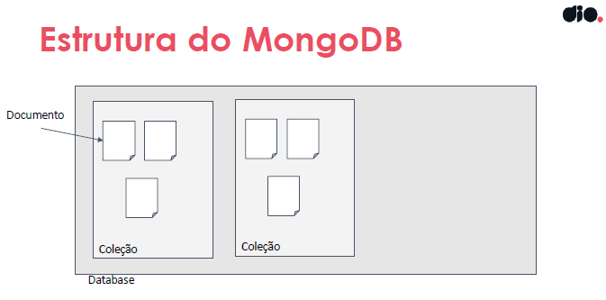

# Introdução aos bancos de dados NoSQL

```
Bootcamp Code Update TQI Back End com Java e Kotlin
Módulo: Trabalhando com Banco de Dados SQL e NoSQL
Instrutora: Pamela Apolinário - 29/08/23 a 29/10/23
```

## Introdução aos Banco de Dados Não Relacionais

Com o advento da Internet e a produção de grandes volumes de dados, os bancos de dados relacionais começaram a apesentar problemas de performance e escalabilidade.

Para tentar minimizar essa situação os bancos de dados não relacionais surgiram como uma proposta bstante viável no que diz respeito à adequação às condições sazonais do tráfego das redes sociais. 

### Objetivo

O objetivo geral do curso é fornecer uma introdução aos Bancos de Dados não relacionais e desenvolver habilidades na criação, modelagem e consulta no MongoDB.


### Apresentação do curso (Ementa)

- [Conceitos básicos dos bancos de dados não relacionais](#conceitos-básicos-dos-bancos-de-dados-não-relacionais)
- [Comparação entre bancos SQL e NoSQL](#comparação-entre-bancos-sql-e-nosql)
- [Vantagens dos bancos NoSQL](#vantagens-dos-bancos-nosql)
- [Desvantagens dos bancos NoSQL](#desvantagens-dos-bancos-nosql)
- [Visão geral dos tipos de NoSQL](#visão-geral-dos-tipos-de-nosql)
- [Características do MongoDB](#características-do-mongodb)
- [Vantagens do MongoDB](#vantagens)
- [Desvantagens do MongoDB](#desvantagens)
- [Instalação e configuração do MongoDB Atlas](#instalação-e-configuração-do-mongodb-atlas)
- [Modelagem de dados usando documentos](#modelagem-de-dados-usando-documentos)
- [Estratégias de modelagem eficientes e escaláveis](#estratégias-de-modelagem-de-dados-eficientes-e-escaláveis)
- [Operações no MongoDB](#operações-no-mongodb)
- [Consultas simples](#consultas-simples)
- [Introdução ao Redis](#introdução-ao-redis)
- [Encerramento](#encerramento)

### Conceitos básicos dos bancos de dados não relacionais

- Termo correto: NOT Only SQL.
- Não seguem modelo de tabelas e relacionamentos.
- Projetados para lidar com alto volume de dados e alta escalabilidade horizontal.
- Alta flexibilidade na estrutura de dados.
- Utilizados em cenários onde a consistência imediata dos dados não é crítica.

### Comparação entre bancos SQL e NoSQL

| SQL | NoSQL|
|:---|:----|
| Modelo de dados fixo | Modelo de dados flexivel |
|Escalabilidade vertical (hardware) | Escalabilidade horizontal |
| Transações ACID 100% | Transações ACID ausentes total ou parcial |
| Linguagem de consulta SQL | Cada SGBD tem sua própria |

### Vantagens dos bancos NoSQL

- Flexibilidade na modelagem
- Alta escalabilidade
- Melhor desempenho em cenário de consulta intensiva
- Tolerância a falhas

### Desvantagens dos bancos NoSQL

- Inconsistência (imediata e momentânea) de dados
- Menor suporte a consultas complexas dependendo do SGDB usado

### Visão geral dos tipos de NoSQL

Existem várias implementaçõe de bancos de dados não relacionais sendo os principais:

#### - Key-Value
Armazena os dados como  pares de chave-valor (key-value) onde cada chave é um identificador único para acessar o valor correspondente.

Apresentam uma escalabilidade horizontal muito boa, acesso aos dados muito rápido pois os armazena em memória. Devido a essas características costuma ser utilizado como cache como é o caso do Redis. 

Principais marcas comerciais: Redis, Amazon Dynamo DB, Riak

Exemplo de aplicação: Utilizado eu um site para armazenar informações de sessão de usuário.


#### - Documento
Armazenam dados em documentos semi-estruturados, geralmente em formato JSON ou BSON (Binário do JSON).

Principais SGBD baseados em documento: MongoDB, CouchBase, Apache CoucheDB.

Exemplo de aplicação: Um catálogo de e-commerce pode usar o MongoDB para armazenar informações de produtos, como nome, descrição, preço e atributos adicionais que variam de produto para produto, o que seria de difícil representação em um BDR.

#### - Coluna
Armazenam dados em formato de colunas, o que permite alta escalabilidade e eficiência em determinados tipos de consultas.

Principais marcas comerciais: Apache Cassandra, ScyllaDB, HBase

Exemplo de aplicação: Um sistema de registro de aplicativos pode usar o Apache Cassandra para armazenar registros de log.

#### - Grafos

Armazenar e consultar dados interconectados, onde os relacionamentos entre os dados são tão importantes quanto os próprios dados.

Principais marcas comerciais: Neo4j, Amazon Neptune, JanusGraph

Exemplo de aplicação: Uma rede social pode usar o Neo4j para armazenar os perfis dos usuários e suas conexões, permitindo consultas eficientes para encontrar amigos em comum.

## Introdução ao MongoDB

### Características do MongoDB

- Banco de dados NoSQL orientado a documentos.
- Grandes volumes de dados, escalabilidade horizontal e modelagem flexível.
- Não exige um esquema.
- Permite que os documentos sejam armazenados em formato BSON.(BinaryJSON), proporcionando uma estrutura semi-estruturada.


### Vantagens

**Flexibilidade de Esquema**: O MongoDB é um banco de dados NoSQL orientado a documentos, o que significa que ele permite que você armazene documentos com estruturas diferentes em uma única coleção. Isso oferece flexibilidade para lidar com dados semiestruturados ou em evolução, tornando-o adequado para cenários em que os requisitos de dados podem mudar com o tempo.

**Alta Escalabilidade**: O MongoDB é altamente escalável e é projetado para dimensionar horizontalmente, o que significa que você pode adicionar servidores para lidar com volumes crescentes de dados e tráfego sem grande esforço. Isso o torna adequado para aplicativos que precisam de escalabilidade.

**Velocidade e Desempenho**: O MongoDB é otimizado para consultas de leitura e gravação rápidas. Ele usa um modelo de armazenamento eficiente que permite recuperações rápidas de dados, tornando-o adequado para aplicativos que exigem baixa latência.

**Suporte a Dados Geoespaciais**: O MongoDB oferece recursos avançados de indexação e consultas para dados geoespaciais. Isso é útil para aplicativos que dependem de dados de localização, como aplicativos de mapeamento e rastreamento.

**Comunidade Ativa e Ecossistema**: O MongoDB tem uma grande comunidade de desenvolvedores e uma ampla variedade de recursos, ferramentas e bibliotecas disponíveis. Isso torna mais fácil encontrar suporte, tutoriais e recursos para ajudar no desenvolvimento e manutenção de aplicativos.

### Desvantagens

**Falta de Transações Multi-documento ACID**: O MongoDB oferece suporte a transações em nível de documento, mas não suporta transações multi-documento que garantam atomicidade, consistência, isolamento e durabilidade (ACID) em várias operações. Isso pode ser problemático para aplicativos que dependem fortemente de transações complexas.

**Consumo de Memória e Recursos**: O MongoDB tende a consumir mais memória do sistema em comparação com alguns outros sistemas de gerenciamento de banco de dados, o que pode limitar sua eficiência em sistemas com recursos limitados.

**Complexidade de Consultas Aninhadas**: Consultas complexas com várias camadas de aninhamento podem ser difíceis de otimizar e podem resultar em lentidão de desempenho.

**Escalabilidade Horizontal Complexa**: Embora o MongoDB seja altamente escalável, configurar clusters e gerenciar a escalabilidade horizontal pode ser complexo e exigir expertise em administração de sistemas distribuídos.

**Requer Monitoramento e Manutenção Adequados**: A configuração e o gerenciamento do MongoDB requerem monitoramento e manutenção atentos. É importante garantir o ajuste fino das configurações para otimizar o desempenho e a segurança do banco de dados.

O MongoDB pode não ser a escolha certa para todos os cenários. Ele é particularmente adequado para aplicativos que requerem flexibilidade de esquema e escalabilidade, mas pode não ser a melhor opção para aplicativos com necessidades de transações complexas ou para aplicativos que exigem conformidade estrita com esquemas de dados rígidos. A escolha de um banco de dados depende dos requisitos específicos do seu projeto.

### Instalação e configuração do MongoDB Atlas

O Mongo Atlas é um serviço de banco de dados gerenciado e open-source fornecido pela MongoDB. Oferece uma plataforma de fácil utilização para hospedar, gerenciar e escalar nossos bancos na nuvem.

Com ele não é necesário preocupar-se com infraestrutura, provisionamnto de servidor e configuração de rede. A plataforma disponibiliza ferramentas interessantes para avaliar a performance dos bancos de dados, fazer o controle de acesso etc.

[Mongo Atlas](https://www.mongodb.com/)

- Crie a base de dados gratuita (M0 Free)
- Selecione o Provedor na Nuvem: AWS, Google Cloud ou Azure
- Defina o nome da base de dados
- Selecione a região: N. Virginia (us-east-1)
- Clicar em [Create]
- Criação dos usuários

### Conexão - Tipos oferecidos

- Compass * 
- Drivers
- Shell
- MongoDB para VS Code
- Atlas SQL

### Monitoramento

O Atlas já traz um módulo de monitoramento nativo sem necessidade de se colocar alguma aplicação de observação.

### Modelagem de dados usando documentos

Como visto anteriormente os Banco de Dados Não-realcionais possuem as seguintes estruturas de persistência:




**Documentos**

- É a unidade básica de armazenamento de dados, num SGDB Não relacional orientado a documentos. Um documento é uma estrutura de dados que geralmente é representada em formato JSON (JavaScript Object Notation) ou BSON (BinaryJSON), mas pode ser mais flexível em termos de estrutura em comparação com as tabelas rígidas em bancos de dados relacionais. Cada documento geralmente contém informações relacionadas a uma entidade específica e é identificado por um campo-chave exclusivo do tipo ObjectId chamado "_id". Cada documento no MongoDB pode ter um tamanho máximo de 16MB.

Estrutura de um documento:

```json
{
_id : ObjectId (""),
"nome_campo" : "valor_campo",
…
}
```

**Coleções**

- Agrupamento lógico de `documentos`. Você pode pensar em coleções como tabelas em bancos de dados relacionais, mas com a diferença de que os documentos dentro de uma coleção podem ter estruturas diferentes. 
- Não exige esquema ou que os documentos tenham a mesma estrutura

**Database**

- Em um banco de dados NoSQL orientado a documentos, um "database" é uma estrutura de alto nível que contém `coleções` de documentos relacionados, oferecendo uma maneira eficaz de organizar e isolar dados para diferentes partes de um aplicativo ou sistema.

- Agrupamentos de coleções

#### Nomeação de coleções

- Devem começar com uma letra ou um underscore (_).
- Podem conter letras, números ou underscores.
- Evitar caracteres especiais (%$#@*& etc)
- Não podem ser vazios.
- Não podem ter mais de 64 bytes de comprimento.

### Estratégias de modelagem de dados eficientes e escaláveis

A modelagem de dados no MongoDB deve ser orientada pelas consultas que serão realizadas com mais frequência e não às entidades e elacionamentos como nos BDR. Nesse caso algumas vezes é mais interessante adotar a desnormalização, que é um preceito contrário ao adotado pelos bancos de dados relacionais. 

Também é possível usar o modelo referencial em casos particulares.


### Desnormalização

No MongoDB, é comum denormalizaros dados para evitar operações de junção (join) custosas. Isso significa que os dados relacionados podem ser armazenados juntos em um único documento, em vez de serem distribuídos em várias coleções, mesmo que ocorram redundâncias.

Geralmente adota-se a desnormalização (Inner document)  quando:

- Os dados aninhados são específicos para o documento pai.
- Os dados aninhados são sempre acessados juntamente com o documento pai.
- A cardinalidade do relacionamento é um-para-muitos (um usuário pode ter várias reservas).

Evita-se usar a desnormalização se os dados aninhados precisarem ser consultados e atualizados independentemente do documento pai. Nesse caso é mais adequado utilizar coleções separadas.

### Modelo referencial 

Esse modelo segue aproximadamente a modelagem relacional. Nesse caso serão criadas três coleções: usuário, destino e reserva, onde a última coleção conterá dois ObjectId: um para referenciar um usuário e outro para referenciar o destino, semelhante às chaves estrangeiras da tabela reserva no modelo relacional. Esse tipo de modelagem deve ser adotada quando:

- os dados têm seu próprio significado e podem ser acessados independentemente do documento pai.
- os dados têm uma cardinalidade mais alta (por exemplo, vários usuários podem ter várias reservas).

Por outro lado deve ser evitado se os dados aninhados precisarem ser consultados e atualizados independentemente do documento pai. Nesse caso é mais adequado utilizar coleções separadas.


## Operações no MongoDB

### Operações 

- **Criar um *database*:**

```
use [nome_base_de_dados]
```
⚠️ Se não existir será criado um databse. Se existir vai abrí-lo.

- **Criar uma *collection***

```
db.createCollection("usuarios")
db.createCollection("destinos")
```
- **Inserir *documents***

```json
db.usuarios.insertOne({
    _id:ObjectId(""), 
    "nome":"Pamela Apolinario",
    "email":"pampam@dio.com.br",
    "idade": 30,
    "data_nasc": "1990-05-10"
});


db.usuarios.insertMany([
    {   
        "nome": "Pamela",
        "idade": 30,
        "email": "pamela.apolinario.borges@gmail.com",
        "endereco": "Av Manoel Marques de Jesus, 380 - Vila Xavier, Araraquara/SP"
    },
    {   
        "nome": "Joana",
        "idade": 31,
        "email": "joana.apolinario.borges.outra@gmail.com",
        "endereco": "Av Manoel Marques de Jesus, 380 - Vila Xavier, Araraquara/SP"
    },
]);
```

### Consultas simples


## Breve apresentação do Redis

### Introdução ao Redis

## Encerramento

## Conclusão
```
Ao final desse curso conduzido com grande competência pela jovem Instrutora Pamela Apolinário temos a agradável sensação de atingimento dos objetivos propostos.

Foi um mergulho muito bem conduzido nos principais conceitos teóricos, consolidados por exemplos práticos de grande utilidade instrucional. 

Como crítica construtiva fica a sugestão de colocar os testes ou verificações de conhecimento ao longo dos tópicos abordados e não apenas na finalização do treinamento, já que, pela própria característica do curso, com alta densidade de informações, torna-se mais complexa a revisão de todo o material.

Destaco ainda as excelentes indicações de referências e materiais de apoio que ajudarão muito no início da jornada do desenvolvedor.
```

## Materiais de apoio e referências

[Repositório do curso no GitHub](https://github.com/pamelaborges/dio-db-nosql)

[Material Oracle sobre bancos NoSQL](https://www.oracle.com/br/database/nosql/what-is-nosql)

[Padrões de Modelagem para NoSQL](https://www.luiztools.com.br/post/padroes-para-modelagem-de-dados-documentos-em-mongodb//)

[Introdução ao MongoDB](https://www.mongodb.com/docs/manual/introduction/)

[Introdução ao Mongo Atlas](https://www.mongodb.com/docs/atlas/getting-started/)

[Aplicação para modelagem](https://jsonformatter.curiousconcept.com/)

[Operadores de Update](https://www.mongodb.com/docs/manual/reference/operator/update/)

[Buscar e modificar documentos](https://www.mongodb.com/docs/manual/reference/method/db.collection.findAndModify/)

[Buscar um documento](https://www.mongodb.com/docs/manual/reference/method/db.collection.findOne/)

[MongoDB Inserir documentos](https://www.mongodb.com/docs/v6.0/tutorial/insert-documents/)

[Operadores do Mongo](https://www.mongodb.com/docs/manual/reference/operator/query/)

[Documentação do Redis](https://redis.io/docs/)

[Testar o Redis](https://try.redis.io/)


## Certificado


```
Disclaimer:

Todo o material aqui apresentado foi gerado a partir de minhas anotações 
de aula durante o excelente treinamento ministrado  pela Instrutora 
Pamela Apolinário. Proibida a reprodução e veiculação sem ciência e 
autorização da DIO e do autor.
```
