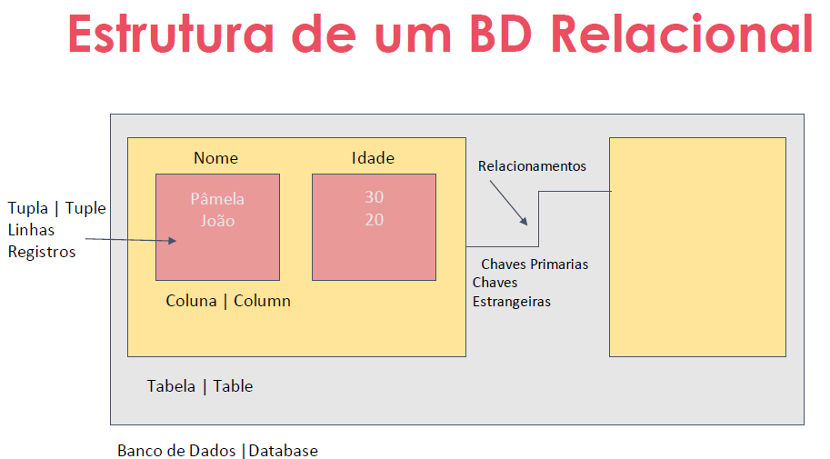
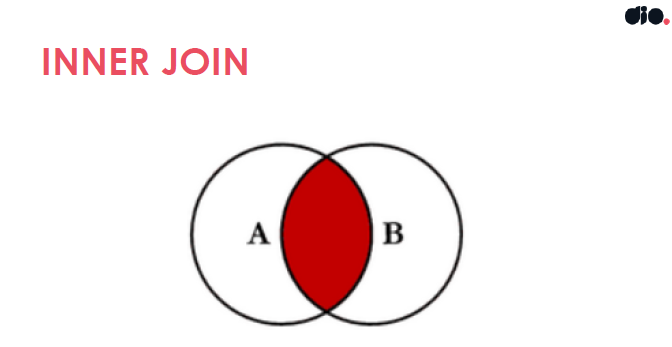
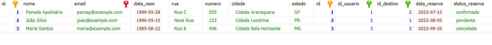
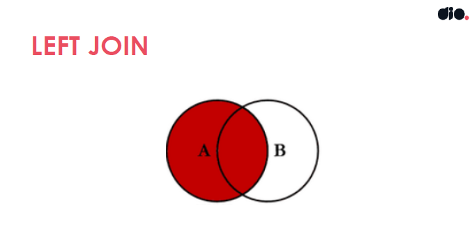
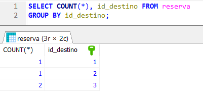

# Introdução aos bancos de dados relacionais (SQL)

```
Bootcamp Code Update TQI Back End com Java e Kotlin
Módulo: Trabalhando com Banco de Dados SQL e NoSQL
Instrutora: Pamela Apolinário - 29/08/23 a 29/10/23
```

## Introdução a Banco de Dados Relacional (SQL)

### Apresentação do curso (Ementa)

- Introdução aos Bancos de Dados Relacionais e conceitos básicos de SQL.
- Modelagem de tabelas, colunas e registros com operações CRUD.
- Chaves primárias e estrangeiras com modelagem de tabelas relacionadas.
- Normalização de dados, identificando e corrigindo problemas de normalização.
- Consultas avançadas com junções e subconsultas (Drop e Alter Table)
- Funções agregadas e agrupamento de resultados com GROUP BY e HAVING.
- Uso de índices para otimização de consultas.

### Objetivo

O objetivo geral do curso é fornecer uma introdução aos Bancos de Dados Relacionais e desenvolver habilidades na criação, modelagem e consulta desses bancos

### Conceitos básicos e estruturas de dados relacionais

- SGBD (Sistema de Gerenciamento de Banco de Dados): Software que gerencia o acesso a vários bancos de dados

- Funcionalidades básicas: CRUD é o acrônimo para : `C`reate - `R`etrieve - `U`pdate e `D`elete que são as operações básicas que podem ser feitas sobre os dados de um banco.


### Estrutura de um Banco de Dados Relacional




### Tipos de Bancos de Dados

- Relacionais/SQL
- Não Relacionais/NoSQL (Not OnlySQL)
- Orientado a Objetos
- Hierárquico
- [Material Oracle sobre BDR](https://www.oracle.com/br/database/what-is-a-relational-database/)


### Características de um BDR

- Relacionamento entre tabelas
- Linguagem de Consulta Estruturada (SQL)
- Integridade referencial
- Normalização de dados
- Segurança
- Flexibilidade e extensibilidade
- Suporte a transações `ACID`

### ACID

É o acrônimo para: 

- **Atomicidade**: A atomicidade garante que uma transação seja tratada como uma `única` unidade de trabalho. Isso garante que todas as operações de uma transação sejam executadas com sucesso, caso contrário nenhuma será validada e serão desfeitas (rollback).

- **Consistência**: Assegura que uma transação leve o banco de dados de um estado consistente para outro. Se uma transação violar qualquer regra, ela será revertida, mantendo a integridade dos dados.

- **Isolamento**: Capacidade de uma transação ser executada de forma isolada, sem interferir em outras transações concorrentes. 

- **Durabilidade**: Garante que as alterações feitas por uma transação confirmada sejam permanentes e persistam no banco de dados, mesmo em caso de falhas no sistema.

Essas características dão consistência e confiabilidade ao banco de dados e o SGBD deve garanti-las em suas transações.

### Introdução e conceitos básicos de SQL

SQL (Structured Query Language) é uma linguagem de programação usada para gerenciar e manipular bancos de dados relacionais. Ela foi desenvolvida em 1970 para permitir que os usuários interajam com sistemas de gerenciamento de banco de dados relacionais (RDBMS) para criar, consultar, atualizar e gerenciar dados de forma eficiente.


Está organizada da seguinte forma:

- **DQL (Data Query Language - Linguagem de Consulta de Dados)**: A DQL é responsável por operações de consulta, ou seja, ela permite que você recupere informações de um banco de dados. O comando principal da DQL é o `SELECT`, que é usado para recuperar dados de tabelas com base em critérios de pesquisa específicos. A DQL não faz alterações nos dados do banco de dados, apenas os recupera para exibição ou processamento.

- **DML (Data Manipulation Language - Linguagem de Manipulação de Dados)**: Esses comandos são usados para manipular os dados dentro das tabelas do banco de dados. Isso inclui inserir, atualizar, excluir e consultar registros. Exemplos de comandos DML incluem INSERT, UPDATE, e DELETE.

- **DDL (Data Definition Language - Linguagem de Definição de Dados)**: Esses comandos são usados para definir a estrutura do banco de dados, criar tabelas, definir índices, criar restrições e realizar outras operações que afetam a estrutura dos dados. Exemplos de comandos DDL incluem CREATE TABLE, ALTER TABLE, DROP TABLE, e CREATE INDEX.

- **DCL (Data Control Language - Linguagem de Controle de Dados)**: Esses comandos são usados para definir permissões de acesso aos dados e gerenciar a segurança do banco de dados. Exemplos de comandos DCL incluem GRANT e REVOKE, que concedem ou revogam permissões a usuários e papéis.

- **TCL (Transaction Control Language - Linguagem de Controle de Transação)**: Esses comandos são usados para gerenciar transações no banco de dados, controlando o início, o comprometimento e o cancelamento de transações. Exemplos de comandos TCL incluem BEGIN, COMMIT, ROLLBACK, e SAVEPOINT.

### Sintaxe básica e nomenclatura

Em regras gerais:

- Os nomes devem começar com uma letra ou com um caractere de sublinhado (_)
- Os nomes podem conter letras, números e caracteres de sublinhado (_).
- Sensibilidade a maiúsculas e minúsculas

### MER e DER: Modelagem de Bancos de Dados

O Modelo Entidade-Relacionamento (MER) é representado através de diagramas chamados Diagramas Entidade-Relacionamento (DER).

**Conceitos importantes**

- **DOMÍNIO**: Um domínio em modelagem de dados representa o conjunto de valores possíveis que um atributo específico pode ter, e ele desempenha um papel fundamental na definição das regras e restrições dos dados em um sistema ou banco de dados.

- **ENTIDADES**: As entidades representam objetos do mundo real, conceitos ou coisas dentro do domínio que está sendo modelado. Elas são os principais elementos de dados que você deseja rastrear no seu sistema. Entidades são frequentemente substantivos concretos ou abstratos que representam de forma clara sua função dentro do `domínio` da modelagem e têm `atributos` associados que descrevem detalhes específicos sobre elas. Por exemplo, em um sistema de gerenciamento de biblioteca, as entidades podem incluir "Livro", "Autor" e "Usuário".

- **ATRIBUTOS**: Os atributos são características ou propriedades que descrevem uma entidade. Eles fornecem informações mais detalhadas sobre uma entidade específica. Em termos simples, os atributos são os campos ou informações que você deseja armazenar sobre uma entidade. Por exemplo, para a entidade "Livro", os atributos podem incluir "Título", "Autor", "Ano de Publicação" e "Número de Páginas". 

- **RELACIONAMENTOS**: epresentam as associações ou conexões entre diferentes entidades em um modelo de dados. Eles mostram como as entidades estão relacionadas umas com as outras e como elas interagem no contexto do sistema ou domínio que está sendo modelado. 


- **CARDINALIDADE**: A cardinalidade em um relacionamento entre entidades descreve o número de instâncias de uma entidade que podem estar relacionadas a um número específico de instâncias da outra entidade. Ela define quantos registros ou ocorrências de uma entidade podem estar associados a registros ou ocorrências da outra entidade. A cardinalidade é geralmente expressa usando termos como:
    - "um para um" (1:1)
    - "um para muitos" (1:N) ou
    - "muitos para muitos" (N:N).


### Modelo de estudo: Reserva de viagens


### Criando MER com IA

[Aplicativo para criação de MER com IA](https://app.quickdatabasediagrams.com/)


### Configuração do Ambiente

Nesse curso não serão instalados SGBDs na máquina do usuário. No entanto é necessário a configuração do ambiente na nuvem do Cloud Clusters IO.

[Cloud Cluster](https://clients.cloudclusters.io/)

Como já possuia o *MySQL* instalado preferi utilizá-lo ao invés do *Cloud Cluster*

Como exemplo, foi criado o banco de dados `viagem` através do MySQL Workbench com o comando:

```sql
create schema "viagens";
```
As demais operações com o Banco de dados foram feitas com o aplicativo [HeidiSQL](https://www.heidisql.com/) que é gratuito e faz consultas usando protocolo HTTP.

Nesse aplicativo é necessário nomear uma `conexão` que no caso chamou-se `MySQLDio` e fornecer a senha root usada na criação do Database.

## Modelagem de Dados Relacionais

### Tabelas, colunas e registros

Para criar as tabelas usa-se o comando `CREATE TABLE`. Para cada atributo (coluna) inserida deve-se definir o tipo de dados e as restrições.

Forma geral:

```
CREATE TABLE nome_da_tabela (
  [nomecoluna1] [tipo] [restrições ou CONSTRAINTS] COMMENTS "comentário_opcional",
  [nomecoluna2] [tipo] [restrições ou CONSTRAINTS] COMMENTS "comentário_opcional",
  [nomecoluna3] [tipo] [restrições ou CONSTRAINTS] COMMENTS "comentário_opcional",
  ...
  [nomecolunaN] [tipo] [restrições ou CONSTRAINTS] COMMENTS "comentário_opcional"
)
```

**Tipos de dados mais comuns**:

- INT: Inteiro (Integer)
- NUM: Decimal/Numérico (Decimal/Numeric)
- CHAR/VARCHAR: Caractere/Varchar (Character/Varchar)
- DATE: Data/Hora (Date/Time)
- BOOL: Booleano (Boolean)
- TEXT: Texto longo (Text)

**Restrições**

- PK: PRIMARY KEY (chave primária)
- FK: FOREIGN KEY (chave estrangeira)
- NN: NOT NUL (não nulo)
- UQ: UNIQUE (única)
- ZF: ZERO FILL ()
- AI: AUTO INCREMENT (auto incremento)
- UN: UNSIGNED (não atribuído)
- B : BINARY (binário)
- G : GENERATED (gerada)

**Criação da tabela usuario**

```sql
CREATE TABLE `viagens`.`usuario` (
  `id` INT NOT NULL AUTO_INCREMENT,
  `nome` VARCHAR(100) NOT NULL,
  `email` VARCHAR(50) NOT NULL,
  `endereco` VARCHAR(150) NOT NULL,
  `data_nasc` DATE NOT NULL COMMENT 'data de nascimento',
  PRIMARY KEY (`id`)
  );
```


**Criação da tabela destino**

```sql
create table viagens.destino (
	id INT,
    nome VARCHAR(50) NOT NULL,
    descricao VARCHAR(255) NOT NULL
    );
```

**Criação da tabela reserva**

```sql
create table viagens.reserva (
	id INT,
    id_usuario INT,
    id_destino INT,
    data_reserva DATE,
    status_reserva VARCHAR(15) DEFAULT 'Pendente' COMMENT 'Estados possíveis: Pendente - Confirmada - Cancelada'
    );
```

### Operações CRUD: Insert e Select


#### INSERT

Para inserção de registros nas tabelas usa-se o comando `INSERT INTO` conforme exemplo a seguir:

Forma geral:

```
INSERT INTO nome_da_tabela (
  nome_coluna1,
  nome_coluna2,
  ...
  nome_colunaN
) VALUES (
  valor_da_coluna1,
  valor_da_coluna2,
  valor_da_coluna3,
  ...
  valor_da_colunaN,
);

Obs: No caso de VARCHAR, CHAR ou TEXT o valor deve estar ente aspas "".
```
Exemplo:

```sql
INSERT INTO usuario (
  id, 
  nome, 
  email, 
  data_nasc, 
  endereco)
VALUES (
  1,
  "Pamela Apolinario",
  "pamap@gmail.com",
  "1992-10-05",
  "Av. das Rosas, 100 - Alto Araraquara / SP"
  );
```

#### SELECT

Para leitura da tabela usa-se o comando `SELECT .. FROM .. WHERE` conforme a estrutura geral abaixo:

```
SELECT [lista_de_colunas ou * para todas] FROM [nome_tabela] WHERE [condição];
```

Operadores para WHERE

- `= (igualdade)`

- `<> ou != (desigualdade)`

- `> (maior que)`

- `< (menor que)`

- `>= (maior ou igual que)`

- `<= (menor ou igual que)`

- `LIKE (comparação de padrões)`

- `IN (pertence a uma lista de valores)`

- `BETWEEN (dentro de um intervalo)`

- `AND (e lógico)`

- `OR (ou lógico)`

Registros inseridos a partir dos comandos [SQL do GitHub](https://github.com/pamelaborges/dio-bd-relacional/blob/main/aula3.2.sql) disponibilizado pela Instrutora Pamela Apolinário.

```sql
-- Inserção na Tabela usuario
INSERT INTO viagens.usuario (id, nome, email, data_nasc, endereco) VALUES 
(2, 'João Silva', 'joao@example.com', '1990-05-15', 'Rua A, 123, Cidade Londrina, Estado PR'),
(3, 'Maria Santos', 'maria@example.com', '1985-08-22', 'Rua B, 456, Cidade Belo Horizonte, Estado MG'),
(4, 'Pedro Souza', 'pedro@example.com', '1998-02-10', 'Avenida C, 789, Cidade Campos, Estado RJ');


-- Inserção na Tabela detino
INSERT INTO viagens.destino (id, nome, descricao) VALUES 
(1, 'Praia das Tartarugas', 'Uma bela praia com areias brancas e mar cristalino'),
(2, 'Cachoeira do Vale Verde', 'Uma cachoeira exuberante cercada por natureza'),
(3, 'Cidade Histórica de Pedra Alta', 'Uma cidade rica em história e arquitetura');

-- Inserção na Tabela reserva
INSERT INTO viagens.reserva (id, id_usuario, id_destino, data_reserva, status_reserva) VALUES 
(1, 1, 2, '2023-07-10', 'confirmada'),
(2, 2, 1, '2023-08-05', 'pendente'),
(3, 3, 3, '2023-09-20', 'cancelada');
```

**Pesquisar TODOS os usuários:**

```sql
SELECT * FROM viagens.usuario;
```

**Selecionar apenas o nome e o email dos usuários**
```sql
SELECT nome, email FROM usuario;
```

**Selecionar os usuários que possuem o nome "João Silva"** 
```sql
SELECT * FROM usuario WHERE nome = 'João Silva';
```

**Selecionar os usuários que nasceram antes de uma determinada data**
```sql
SELECT * FROM usuario WHERE data_nascimento < '1990-01-01';
```

**Uso do Like**
```sql
SELECT * FROM usuario WHERE nome LIKE '%Silva%';
SELECT * FROM usuario WHERE nome LIKE 'Jo_o%';
```
### Operações CRUD: Update e Delete

São comandos "perigosos" pois podem destruir completamente os dados do banco. Sugere-se usá-los sempre com a cláusula WHERE [condição]
minimizando-se, assim, a possibilidade de uma deleção ou atualização indevida.

### Update

Forma geral do comando:

```
UPDATE [nome_da_tabela] SET 
   coluna1 = novo_valor,
   coluna2 = novo_valor,
   ...
   colunaN = novo_valor

WHERE [condição];
```

Exemplo

```sql
UPDATE usuario SET endereco = 'Nova Rua, 123, Cidade Londrina, Estado PR' WHERE email = 'joao@example.com';

UPDATE usuario SET 
	nome = 'Pamela A. Santos' , 
	endereco = 'Av. das Rosas, 100, Cidade Araraquara, Estado SP' 
WHERE email = 'pamap@gmail.com' ;
```

### Delete

Forma geral do comando:

```
DELETE FROM [nome_da_tabela] 
WHERE [condição];
```
Exemplo

```sql
DELETE FROM usuario WHERE email = 'pamap@gmail.com';
```
### Alterando e excluindo tabelas (ALTER e DROP TABLE)

#### DROP TABLE
Usado para remover de forma *permanente* uma tabela existente em um Banco de Dados Relacional.

Forma geral:

```
DROP TABLE [nome_da_tabela];
```

#### ALTER TABLE
Usado no SQL para modificar a estrutura de uma tabela existente em um Banco de Dados Relacional. Ações possíveis:
- Adicionar, alterar ou excluir colunas
- Modificar restriçõe e ìndices
- Renomear tabelas

Forma geral:

```sql
ALTER TABLE [nome_da_tabela];
```

Para explicação desses dois novos comando foi proposto a seguinte situação problema:

"Usuários com endereços longos não estão conseguindo realizar cadastro no sistema"

Opções:

1. Recriar a tabela, migrar os dados e excluir a tabela anterior

2. Alterar estrutura da tabela

**Resolvendo pela opção 1:**

- Para aplicação dessa solução será criada uma nova tabela `usuario_nova` com o tamanho do campo endereço aumentado.

```sql
CREATE TABLE usuario_nova (
  id INT,
  nome VARCHAR(255) NOT NULL COMMENT 'Nome do usuário',
  email VARCHAR(255) NOT NULL UNIQUE COMMENT 'Endereço de e-mail do usuário',
  data_nasc DATE NOT NULL COMMENT 'Data de nascimento do usuário',
  endereco VARCHAR(100) NOT NULL COMMENT 'Endereço do usuário'
);
```

- Usaremos o código abaixo para copiar os dados da tabela antiga para a nova:

```sql
INSERT INTO usuario_nova (id, nome, email, data_nasc, endereco)
SELECT id, nome, email, data_nasc, endereco 
FROM usuario;
```

- Para deletar a tabela `usuario` enviamos o comando:

```sql
DROP TABLE usuario;
```

- Finalmente, renomearemos a tabela `usuario_nova` para `usuario`.

```sql
ALTER TABLE usuario_nova RENAME usuario;
```
**Resolvendo pela opção 2:**

Nessa solução basta alterar diretamente o tamanho do campo desejado. Por exemplo, para alterarmos o tamanho da coluna `endereco` de 100 para 150, podemos usar o comando abaixo:

```sql
ALTER TABLE usuario MODIFY COLUMN endereco VARCHAR(150);
```

### Chaves primárias e estrangeiras

**CHAVE PRIMÁRIA**

A chave primária é um atributo ou conjunto de atributos que identifia de forma única cada registro (tupla) da tabela.

**Características**

- Identifica de forma exlusiva um registro
- Não pode conter valores nulos
- Em uma tabela só pode haver uma coluna contendo as chaves primárias

**Estrutura para criar uma Primary Key**

```sql
CREATE TABLE nome_tabela (
  nome_campo PRIMARY KEY AUTOINCREMENT, 
  ... 
)
```

**Estrutura para alterar uma coluna para Primary Key**

```sql
ALTER TABLE nome_tabela MODIFY COLUMN nome_campo INT PRIMARY KEY;
```

**CHAVE ESTRANGEIRA**

Usada para estabelecer e manter a integridade dos dados entre tabelas relacionadas.

**Características**
- Pode ter valores nulos, conhecidos como *registros órfãos*.
- É possível ter mais de uma FK ou nenhuma em uma tabela.

**Estrutura para criar uma Foreign Key**

```sql
CREATE TABLE nome_tabela (
   id INT PRIMARY KEY,
   chave_estrangeira INT,
   . demais campos
   .
   .
   FOREIGN KEY (chave_estrangeira) REFERENCES outra_tabela (id)
);
```
**Estrutura para alterar uma Foreign Key**

```sql
ALTER TABLE tabela1 ADD CONSTRAINT nome_constraint 
  FOREIGN KEY (chave_estrangeira_tabela1) REFERENCES tabela2 (pk_tabela2);
```

Constraints para ALTER TABLE:

- ON DELETE: especifica o que acontece com os registros dependentes quando um registro pai é excluído.

- ON UPDATE: define o comportamento dos registros dependentes quando um registro pai é atualizado. Pode ter os tipo:

  - CASCADE: replicar a alteração do pai nos filhos
  - SET NULL: remover a integridade referencial 
  - SET DEFAULT: definir um valor para que todos os registros tenham um pai.
  - RESTRICT

⚠️ As constraints são responsáveis por manter a *integridade referencial* dos dados.

### Alterações no Banco de Dados *viagens* 

**Etapas para inclusão de chaves primárias e estrangeiras**

1. Alteração da tabela *usuario* para transformar o campo *id* em PK.

```sql
ALTER TABLE usuario 
MODIFY COLUMN id INT AUTO_INCREMENT,
ADD PRIMARY KEY (id);
```

2. Alteração da tabela *destino* para transformar o campo *id* em PK.

```sql
ALTER TABLE destino 
MODIFY COLUMN id INT AUTO_INCREMENT,
ADD PRIMARY KEY (id);
```

3. Alteração da tabela *reserva* para transformar o campo *id* em PK e incluir as chaves estrangeiras.

```sql
ALTER TABLE reserva 
MODIFY COLUMN id INT AUTO_INCREMENT,
ADD PRIMARY KEY (id);
```


```sql
ALTER TABLE reserva ADD CONSTRAINT fk_reserva_usuario
  FOREIGN KEY (id_usuario) REFERENCES usuario (id);
```

```sql
ALTER TABLE reserva ADD CONSTRAINT fk_reserva_destino
FOREIGN KEY (id_destino) REFERENCES destino (id);
```

## ⚠️ Importante

Para finalizar esse tópico foi apresentado um exemplo de como uma FOREIGN KEY à qual foi atribuída a uma `CONSTRAINT` *fk_usuario* o parâmetro `ON DELETE CASCADE` funciona.

Assim, quando um registro da tabela pai *usuario* for deletado, automaticamente, todos os registros de todas as tabelas relacionadas através da FOREIGN KEY com `ON DELETE CASCADE` definida, serão também deletados.

## Normalização de dados

A normalização de dados é um processo no qual se organiza e estrutura um banco de dados relacional de forma a eliminar redundâncias e anomalias, garantindo a consistência e integridade dos dados.

São definidas mais de seis formas normais, sendo que na prática aplica-se até a terceira.

### Primeira Forma Normal (1FN - Atomicidade)

A 1FN estabelece que cada valor em uma tabela deve ser atômico, ou seja, indivisível. Nenhum campo deve conter múltiplos valores ou listas. No nosso modelo em estudo, o campo "endereco" contém múltiplos valores, como rua, número, cidade e estado. Para atingir a 1FN, precisamos dividir o campo "endereco" em colunas separadas.

Para fazer essa alteração na tabela *usuario* deve-se seguir os seguintes passos:
- Alterar a tabela acrescentando os campos: rua, numero, cidade e estado.
- Realizar a migração dos dados para os novos campos
- Remover a coluna endereço

**Passo 1 - Criação dos novos campos**
```sql
ALTER TABLE usuario
ADD rua VARCHAR(100),
ADD numero VARCHAR(100),
ADD cidade VARCHAR(100),
ADD estado VARCHAR(100);
```
Passo 2 - Migração dos dados

Para essa etapa foi elaborada um script usando a função SUBSTRING_INDEX:

```sql
UPDATE usuario
SET rua    = SUBSTRING_INDEX (SUBSTRING_INDEX (endereco, ',', 1), ',', -1) ,
    numero = SUBSTRING_INDEX (SUBSTRING_INDEX (endereco, ',', 2), ',', -1) ,
    cidade = SUBSTRING_INDEX (SUBSTRING_INDEX (endereco, ',', 3), ',', -1) ,
    estado = SUBSTRING_INDEX (endereco, ',', -1) ;
```

Passo 3 - Remoção da coluna *endereco*

```sql
ALTER TABLE usuario
DROP COLUMN endereco;
```

🥺 🛠️ Correção da tabela usuário após erro na digitação do script que colocou número da rua no lugar do nome do usuário:

```sql
UPDATE usuario 
SET nome = 'Pamela Apolinário'
WHERE email = 'pamap@example.com';

UPDATE usuario 
SET nome = 'João Silva'
WHERE email = 'joao@example.com';


UPDATE usuario 
SET nome = 'Maria Santos'
WHERE email = 'maria@example.com';

UPDATE usuario 
SET nome = 'Pedro Souza'
WHERE email = 'pedro@example.com';
```

### Segunda Forma Normal (2FN)

Requisitos para se obter a segunda forma normal:

- A 2FN estabelece que uma tabela deve estar na 1FN
- Todos os atributos `não chave` devem depender totalmente da chave primária.

⚠️ Se sua tabela tem uma chave primária simples não existe a possibilidade de termos dependência parcial e portanto ela já se encontra na 2FN.

No nosso modelo de estudo todos os campos não-chave dependem da chave primária `id` e assim sendo a tabela *usuraio* já se encontra também na 2FN.

### Terceira Forma Normal (3FN)

A 3FN elimina dependências transitivas entre os atributos não chave, garantindo que cada atributo não chave dependa apenas da chave primária, não havendo dependências indiretas entre eles. 

Assim, a terceira forma normal esabelece que:

- A tabela já deve estar na 2FN
- Nenhuma coluna `não-chave` pode depender de outra coluna `não-chave`.

No modelo sob estudo, na tabela `usuario` o campo não-chave *cidade* depende do campo não-chave *estado* e portanto precisaria ser normalizada.

Essa decisão passa pela análise e bom senso do analista. Num sistema contábil, por exemplo, onde alíquotas são diferenciadas por estado, talvez fizesse sentido essa normalização.

 No nosso modelo não se percebe essa necessidade e portanto não precisa ser aplicada.


## Consultas avançadas

Muita vezes é necessário realizar a consulta a várias tabelas de um banco de dados para se obter a informação desejada.

Para isso é necessário usar as `consultas avançadas` usando o comando JOIN e as subconsultas.

### Consultas com junções (JOINS) e subconsultas

### Joins

São usadas no SQL para combinar dados de duas ou mais tabelas relacionadas em uma única consulta.

Existem quatro tipos de JOIN:

- INNER JOIN
- LEFT JOIN ou LEFT OUTER JOIN
- RIGHT JOIN ou RIGHT OUTER JOIN
- FULL JOIN oU FULL OUTER JOIN

**INNER JOIN**

Retorna apenas as linhas que têm correspondência em ambas as tabelas envolvidas na junção. A junção é feita com base em uma condição de igualdade especificada na cláusula ON.

Forma geral:

```sql
SELECT * FROM tabela1
INNER JOIN tabela2 ON tabela1.coluna = tabela2.coluna
```
Como exemplo prático vamos usar o INNER JOIN para consultar as reservas feitas para um determinado usuário no nosso banco de dados **viagens**

```sql
SELECT * FROM usuario us
INNER JOIN reserva rs ON us.id = rs.id_usuario
INNER JOIN destino ds ON rs.id_destino = ds.id
;
```
- A primeira linha seleciona todos os registros da tabela `usuario` que passará a ser referenciada pelo alias `us`.

- A segunda linha busca todas as reservas na qual o `id` do usuário na tabela `usuario` seja igual ao campo `id_usuário` na tabela `reserva` que agora é referenciada pelo álias `rs`.

- A terceira linha faz uma junção entre a coluna `id` da tabela destino e a coluna `id_destino` da tabela `reserva`, aprensentado-as no resultado.

O INNER JOIN corresponde ao Diagrama de Venn abaixo:



**LEFT JOIN**

Retorna todas as linhas da tabela à esquerda do JOIN e as linhas correspondentes da tabela à direita. Se não houver correspondência, os valores da tabela à direita serão NULL.

Forma geral:

```sql
SELECT * FROM tabela1
LEFT JOIN tabela2 ON tabela1.coluna = tabela2.coluna;
```
Inserimos um novo usuário que ainda não tem reserva para exemplificar o uso do LEFT JOIN.

```sql
INSERT INTO usuario (nome, email, data_nasc, rua, numero, cidade, estado) 
VALUES (
  "Abgail Sem Reserva", 
  "abglmnz@teste.com",
  "1992-05-05", 
  "Rua do Carmo", 
  "1560 A", 
  "Belo Monte", 
  "MS"
);
```
Agora vamos fazer um INNER JOIN e um LEF JOIN para compara os resultados.

INNER JOIN

```sql
SELECT * FROM usuario us
INNER JOIN reserva rs ON us.id = rs.id_usuario
INNER JOIN destino ds ON rs.id_destino = ds.id
;
```
Resultado:




LEFT JOIN
```sql
SELECT * FROM usuario us
LEFT JOIN reserva rs ON us.id = rs.id_usuario
LEFT JOIN destino ds ON rs.id_destino = ds.id
;
```
Resultado:


O LEFT JOIN corresponde ao Diagrama de Venn abaixo:



**RIGHT JOIN**

Retorna todas as linhas da tabela à direita do JOIN e as linhas correspondentes da tabela à esquerda. Se não houver correspondência, os valores da tabela à esquerda serão NULL.

Forma geral:

```sql
SELECT * FROM tabela1
RIGHT JOIN tabela2 ON tabela1.coluna = tabela2.coluna;
```
Para exemplificar vamos inserir um novo destino para o qual não existe reserva. Em seguida faremos um consulta em reserva buscando as informações de destino.

Inserindo um novo destino:

```sql
INSERT INTO destino (nome, descricao)
VALUES ("destino sem reserva", "Um belo destino ainda não visitado");
```
Executando o RIGHT JOIN
```sql
SELECT * FROM reserva rs
RIGHT JOIN destino ds
ON rs.id_destino = ds.id
;
```
Resultado:


O RIGHT JOIN corresponde ao Diagrama de Venn abaixo:


### SubConsultas ou consultas aninhadas

São consultas mais complexas permitindo que você use o resultado de uma consulta como entrada para outra consulta. As subconsultas podem ser usadas em várias partes de uma consulta com: 
- SELECT: 
- FROM: 
- WHERE: 
- HAVING: 
- JOIN

Para ilustrar, imagine que precisássemos consultar `todos` os destinos para os quais não há reservas. Para isso faremos uma consulta na tabela `destino` onde o procurando por um `id` que não esteja presente na tabela `reserva`. Segue o código SQL para essa consulta:

```sql
SELECT * FROM destino   
WHERE id NOT IN (SELECT id_destino FROM reserva);
```

Agora vamos procurar por  usuários que não realizaram nenhum tipo de reserva:

```sql
SELECT * FROM usuario   
WHERE id NOT IN (SELECT id_usuario FROM reserva);
```
Para finalizar esse tópico de **subconsultas** vamos consultar para cada usuário da tabela `usuario` o total de reservas feitas. Para isso a subconsulta usará a função `count(*)` conforme segue:

```sql
SELECT nome, 
   (SELECT COUNT(*) FROM reserva WHERE id_usuario = usuario.id) AS total_reservas 
FROM usuario;
```
⚠️ A cláusula `AS total_reservas` nomeia uma coluna como **total_reservas** para apresentação da totalização no resultado da consulta.

### Funções agregadas, agrupamentos e ordenação de resultados

#### *Funções agregadas*

São funções que realizam um pré-processamento ou cálculos nas colunas retornando um único valor. As mais utilizadas são:

- COUNT: Conta o número de registros
- SUM: Soma os valores de uma coluna numérica
- AVG: Calcula a média dos valores de uma coluna numérica
- MIN: Retorna o valor mínimo de uma coluna
- MAX: Retorna o valor máximo de uma coluna


**Exemplos**

#### Contar todos os usuários cadastrados

```sql
SELECT COUNT(*) FROM  usuario;
```
#### Contar todos os usuários cadastrados nomeando a coluna de retorno

```sql
SELECT COUNT(*) AS Total_Usuarios FROM  usuario;
```
⚠️ Cuidado para não dar espaço entre o nome da função e os parênteses. Isso gera um erro.

#### Contar apenas os usuários que tem reserva
```sql
SELECT COUNT(*) AS 'Total de usuarios' FROM  usuario us
INNER JOIN reserva rs ON us.id = rs.id_usuario;
```
Consultar o usuário com maior idade. Usaremos , além da função MAX(), a função TIMESTAMPDIFF() que calcula a diferença entre duas datas fornecidas e retorna o resultado em ano, mês ou dia.

```sql
SELECT MAX(TIMESTAMPDIFF(YEAR, data_nasc, CURRENT_DATE())) AS 'Maior idade' FROM usuario; 
```

#### *Agrupamentos de resultados*

É um recurso de consulta que permite agrupar o resultado de uma *query*. É caracterizado pela cláusula `GROUP BY` que é o critério de agrupamento.  

Sintaxe básica:

```sql
SELECT
	column1,
	column2,
	aggregate_function(column3)
FROM
	table_name
GROUP BY
	column1,
	column2;
```

Para exemplificar vamos inserir mais um registro na tabela `reserva` para que o usuário com  id_usuario=1 tenha mais um destino (id_destino = 3) ;

```sql
INSERT INTO reserva (id_usuario, id_destino)
VALUES (1,3);
```
Agora vamos consultar quantas reservas existem para cada destino:

```sql
SELECT COUNT(*), id_destino FROM reserva
GROUP BY id_destino;
```
Saída:



#### *Ordenação de resultados*

Permite ordenar a saída da consulta segundo algum critério como por ordem alfabética, crescente, decrescente, etc. Para isso, usa-se a cláusula `ORDER BY`.

Sintaxe básica

```sql
SELECT 
    select_list
FROM
    table_name
ORDER BY 
    sort_expression [ASC | DESC];
```

Vamos ordenar a saida anterior ordenando pela coluna criada 'Qte reservas':

```sql
SELECT COUNT(*) AS 'Qte reservas', id_destino FROM reserva
GROUP BY id_destino
ORDER BY 'Qte reservas' DESC;
```

A cláusula DESC (decrescente) indica que a ordenação deve ser feita do maior para o menor.


### Análise do Plano de Execução e Indices de busca

#### Análise do Plano de Execução

Os índices são estruturas de dados que aceleram as pesquisas e a recuperação de informações. Podem ser criados para uma ou mais colunas e agilizam a busca dos dados indexados.

Esses índices são obtidos a partir da `Análise do Plano de Execução` que  permite examinar as operações realizadas e as mais tabelas acessadas possibilitando a identificação de possíveis melhorias de desempenho.

É possível utilizar um comando para avaliar o desempenho das consultas antes e depois da aplicação dos índices. Esse comando é o `EXPLAIN`.

Sintaxe básica:

```sql
EXPLAIN
  SELECT * FROM tabela;
```
Os campos que podem ser retornados pelo comando EXPLAIN são:

- select_type: "SIMPLE", "SUBQUERY" , "JOIN"
- table
- type: "ALL" , "INDEX" entre outros
- possible_keys: Os índices possíveis que podem ser utilizados na operação
- key: O índice utilizado na operação, se aplicável
- key_len: O comprimento do índice utilizado
- ref: As colunas ou constantes usadas para acessar o índice
- rows

#### Índices de busca

Esses recursos são fundamentais para melhorar o desempenho das consultas e otimizar a recuperação de informações em bancos de dados.

Para criar um índice use a sintaxe:

```sql
CREATE INDEX index_name ON tabela1(coluna1, coluna2)
```

## Mapa mental dos tópicos do curso e revisão

### Encerramento

ORM (Object-Relational Mapping), em português Mapeamento Objeto-Relacional, é uma técnica de programação que permite que os desenvolvedores interajam com bancos de dados relacionais usando objetos em vez de consultas SQL diretas. 

Isso simplifica o desenvolvimento de aplicativos e melhora a manutenção do código, pois os desenvolvedores podem trabalhar com estruturas de dados orientadas a objetos em vez de lidar diretamente com tabelas e SQL.

O funcionamento básico de um ORM envolve as seguintes etapas:

1. Mapeamento de Objetos para Tabelas: O ORM mapeia classes e objetos da linguagem de programação para tabelas e registros no banco de dados. Cada classe representa uma tabela, e cada objeto da classe representa uma linha na tabela.

2. Operações de CRUD: Os ORM fornecem métodos para criar, ler, atualizar e excluir registros no banco de dados. Isso permite que os desenvolvedores usem código orientado a objetos para realizar operações de banco de dados, como salvar, recuperar e modificar dados.

3. Geração de SQL: O ORM é responsável por gerar as consultas SQL necessárias para realizar operações de banco de dados com base nas operações de objeto executadas pelo desenvolvedor. Isso significa que os desenvolvedores não precisam escrever consultas SQL manualmente.

4. Mapeamento de Resultados: Quando os dados são recuperados do banco de dados, o ORM mapeia os resultados em objetos da linguagem de programação. Isso facilita o acesso aos dados do banco de dados usando código orientado a objetos.

Aqui estão alguns exemplos de ORM populares em diversas linguagens de programação:

- **Hibernate**: É um ORM popular para a linguagem Java. Ele permite que os desenvolvedores interajam com bancos de dados relacionais usando objetos Java.

- **Entity Framework**: É um ORM desenvolvido pela Microsoft para a plataforma .NET. Ele permite que os desenvolvedores trabalhem com bancos de dados usando objetos .NET.

- **Django ORM**: É o ORM embutido no framework web Python Django. Ele fornece um mapeamento de objetos para tabelas do banco de dados e facilita a interação com o banco de dados em aplicativos web Python.

- **Sequelize**: É um ORM para Node.js que suporta vários bancos de dados relacionais, como MySQL, PostgreSQL e SQLite.

- **Ruby on Rails ORM (Active Record)**: O Active Record é a camada ORM do framework Ruby on Rails. Ele simplifica a interação com bancos de dados relacionais usando objetos Ruby.

ORMs são amplamente utilizados no desenvolvimento de aplicativos, especialmente em aplicativos da web, para simplificar a manipulação de dados e melhorar a produtividade dos desenvolvedores.


## Conclusão

Ao final desse curso conduzido com grande competência pela jovem Instrutora Pamela Apolinário temos a agradável sensação de atingimento dos objetivos propostos.

Foi um mergulho muito bem conduzido nos principais conceitos teóricos, consolidados por exemplos práticos de grande utilidade instrucional. 

Como crítica construtiva fica a sugestão de colocar testes de conhecimento ao longo dos tópicos abordados pela própria característica de ser um treinamento de difícil assimilação imediata e alta relevância.

Destaco ainda as excelentes indicações de referências e materiais de apoio que ajudarão muito no início da jornada do desenvolvedor.


## Materiais de apoio e referências

[Repositório do curso no GitHub](https://github.com/pamelaborges/dio-bd-relacional)

[Material Oracle sobre BDR](https://www.oracle.com/br/database/what-is-a-relational-database/)


[Tutorial de SQL](https://www.sqltutorial.org/)

[Aplicativo para criação de DER](https://app.creately.com/)

[Aplicativo para criação de MER com IA](https://app.quickdatabasediagrams.com/)

[Documentação do MariaDB](https://mariadb.com/kb/en/alter-table/)

[Normalização de dados](https://pt.wikipedia.org/wiki/Normaliza%C3%A7%C3%A3o_de_dados)

[Joins ou Junções](https://mariadb.com/kb/en/joins/)

[Funções Agregadas](https://mariadb.com/kb/en/aggregate-functions/)

[Uso dos índices de busca](https://mariadb.com/kb/en/alter-table/#add-index)

## Certificado


```
Disclaimer:

Todo o material aqui apresentado foi gerado a partir de minhas anotações 
de aula durante o excelente treinamento ministrado  pela Instrutora 
Pamela Apolinário. Proibida a reprodução e veiculação sem ciência e 
autorização da DIO e do autor.
```
