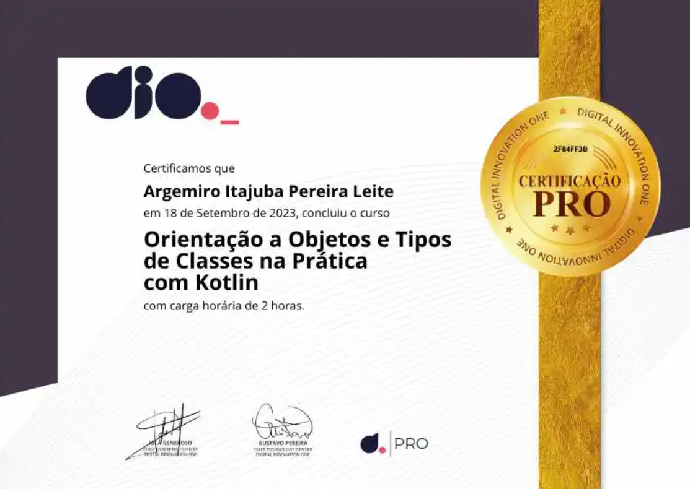

# Orientação a Objetos e Tipos de Classes na prática com Kotlin
```
Bootcamp Code Update TQI Back End com Java e Kotlin
Módulo: Desmistificando Kotlin para programadores Java
Instrutor: Venilton Falvo Jr. @falvojr - 29/08/23 a 29/10/23
```

## Apresentação

### Objetivos

- Conhecer os principais tipos de classe do Kotlin sob o paradigma da orientação a objetos.
- Explorar tipos especiais de classes do Kotlin.
- Desenvolver ou aprimorar a capacidade de `abstração`

## Programação Orientada a Objetos (POO)

POO, ou Programação Orientada a Objetos, é um paradigma de programação que se baseia no conceito de "objetos" para modelar e organizar o código de um programa. 

Nesse paradigma, um objeto é uma representação de uma entidade do mundo real ou conceitual que possui características (atributos) e comportamentos (métodos).

Está fundamentado em quatro pilares:

- Abstração
- Encapsulamento
- Herança 
- Polimorfismo


### Abstração

Habilidade de concentrar se nos aspectos essenciais de um domínio (problema), ignorando (abstraindo) características menos importantes ou acidentais.

Nesse contexto, classes e objetos são abstrações de entidades existentes no domínio/problema em questão.

### Encapsulamento

Encapsular significa ocultar a implementação dos objetos, criando assim interfaces de uso mais concisas e fáceis de usar/entender.

O encapsulamento favorece principalmente dois aspectos de um sistema:

- Manutenção 
- Evolução

### Herança

É a implementação que permite que as classes (modelos) compartilhem suas características (propriedades) e comportamentos (métodos ou funções) entre si.

A `herança` é usada com intenção de promover o reuso de código através de estruturas mais genéricas e flexíveis.


### Polimorfismo

Capacidade de um objeto poder ser referenciado de várias formas ou seja, é capacidade de tratar objetos criados a partir das classes específicas como objetos de uma classe genérica. 

O polimorfismo é frequentemente alcançado por meio da `sobrescrita de métodos` em classes derivadas (subclasses) que herdam de uma classe base (superclasse).Esse conceito nos oferece possibilidades incríveis para criação de soluções mais genéricas.

⚠️ `Polimorfismo` frequentemente ocorre em conjunção com a `herança`, pois classes derivadas frequentemente sobrescrevem métodos herdados para fornecer comportamento específico.

### POO com Kotlin - Exemplos que vamos explorar

Para explorar os conceitos da POO no Kotlin vamos explorar os seguintes tópicos:

- Construtores (Herança)
- Data classes (Encapsulamento)
- Enum classes
- Sealed classes (Polifmorfismo)
- Object keyword

## POO na prática com Kotlin

Kotlin oferece suporte total ao mecanismo tradicional de herança orientada a objetos.

Toda classe em Kotlin é definida por default como `final`, isto é, `fechada`, o que garante que ela não pode ser extendida, nem sobrescrita. 

### Herança simples

```kotlin
open class Dog {                // 1
    open fun sayHello() {       // 2
        println("wow wow!")
    }
}

class Yorkshire : Dog() {       // 3
    override fun sayHello() {   // 4
        println("wif wif!")
    }
}

fun main() {
    val dog: Dog = Yorkshire()
    dog.sayHello()
}
```
**Observações e comentários do código**

- //1. As classes Kotlin são finais por padrão. Se você deseja permitir a herança de classe, marque a classe com o modificador open.

- //2. Os métodos Kotlin também são finais por padrão. Tal como acontece com as classes, o modificador open permite substituí-las.

- //3.  Uma classe herda uma superclasse quando você especifica: SuperclassName() após seu nome. Os parênteses vazios () indicam uma invocação do construtor padrão da superclasse.

- //4. A sobrescrição de métodos ou atributos requer o modificador de sobrescrição `override`.

### Herança com construtor parametrizado


### Herança passando argumentos (Constructor to SuperClass)

### Data classes

As 'classes de dados' facilitam a criação de classes usadas para armazenar valores. Essas classes recebem automaticamente métodos para copiar, obter uma representação de string e usar instâncias em coleções. 

Você pode substituir esses métodos por suas próprias implementações na declaração da classe.

```kotlin
data class User(val name: String, val id: Int) {           // 1
    override fun equals(other: Any?) =
        other is User && other.id == this.id               // 2
}
fun main() {
    val user = User("Alex", 1)
    println(user)                                          // 3

    val secondUser = User("Alex", 1)
    val thirdUser = User("Max", 2)

    println("user == secondUser: ${user == secondUser}")   // 4
    println("user == thirdUser: ${user == thirdUser}")

    // hashCode() function
    println(user.hashCode())                               // 5
    println(secondUser.hashCode())
    println(thirdUser.hashCode())

    // copy() function
    println(user.copy())                                   // 6
    println(user === user.copy())                          // 7
    println(user.copy("Max"))                              // 8
    println(user.copy(id = 3))                             // 9

    println("name = ${user.component1()}")                 // 10
    println("id = ${user.component2()}")
}
```
**Observações e comentários do código**

- //1. Define uma classe de dados `User` com o modificador de dados `data`.

- //2. Substitui (sobrescreve) o método `equals` padrão declarando os usuários iguais se eles tiverem o mesmo ID.

- //3. O método `toString` é gerado automaticamente, o que faz com que a saída println para um objeto do tipo Data Class `(user)` tenha uma boa aparência.

- //4. Nosso método `equals` personalizado considera duas instâncias iguais se seus IDs forem iguais.

- //5. Instâncias de classe de dados com atributos exatamente correspondentes têm o mesmo hashCode.

- //6. A função `copy` gerada automaticamente facilita a criação de uma nova instância.

- //7. `copy` cria uma nova instância, portanto o objeto e sua cópia possuem referências distintas.

- //8. Ao copiar, você pode alterar os valores de determinadas propriedades. `copy` aceita argumentos na mesma ordem que o construtor da classe.

- //9. Use `copy` com argumentos nomeados para alterar o valor independentemente da ordem das propriedades.

- //10. As funções `componentN` geradas automaticamente permitem obter os valores das propriedades na ordem de declaração.

**Saída do código**
```
Saída formatada por toString: User(name=Alex, id=1)

Função equals compara se campos id são iguais:

user == secondUser: true
user == thirdUser: false

Data classes com atributos iguais geram hashCode() iguais:
Usuário 'user' (Alex , 1): hashcode: 63347075
Usuário 'secondUser' (Alex , 1): hashcode: 63347075
Usuário 'thirdUser' (Max , 2): hashcode: 2390846

Criando uma nova instância de user com user.copy(): User(name=Alex, id=1)
Comparando a instância criada com a existente vemos que são diferentes: false
Alterando o valor de name no objeto user com 'user.copy('Max')': User(name=Max, id=1)
Alterando o id de user com parâmetro nomeado 'user.copy(id = 3)': User(name=Alex, id=3)

name = Alex
id = 1
```

### Enum classes

As classes `Enum` são usadas para modelar tipos que representam um conjunto finito de valores distintos, como direções, estados, modos e assim por diante. Algumas das características especiais de uma enumeração em Kotlin incluem:

- ***Valores Enumerados Fixos***: Uma enumeração é usada para definir um conjunto fixo de valores possíveis que um objeto da enumeração pode ter. Cada valor na enumeração é uma instância da enumeração e é criado explicitamente. Esses valores são chamados de membros enum.

- ***Tipo de Dados Distinto***: Uma enumeração tem seu próprio tipo de dados distinto. Isso significa que uma variável de enumeração só pode conter um dos valores predefinidos da enumeração e não pode ter outros valores. Isso ajuda a evitar erros de tipo em tempo de compilação.

- ***Sintaxe Concisa***: A sintaxe para definir uma enumeração em Kotlin é concisa e legível. Cada membro enum é definido na mesma linha da enumeração, seguido por uma vírgula. Isso torna a definição de enumerações simples e fácil de entender.

```kotlin
enum class State {
    IDLE, RUNNING, FINISHED                           // 1
}

fun main() {
    val state = State.RUNNING                         // 2
    val message = when (state) {                      // 3
        State.IDLE -> "It's idle"
        State.RUNNING -> "It's running"
        State.FINISHED -> "It's finished"
    }
    println(message)
}
```
**Observações e comentários do código**

- //1. Define uma classe `enum` simples com três constantes `enum`. O número de constantes é sempre finito e todas são distintas.

- //2. Acessa uma constante `enum` (RUNNING) por meio do nome da classe (State.RUNNING)

- //3.  Com `enums`, o compilador pode inferir se uma expressão "`when`" é exaustiva, para que você não precise usar a condição `else`.

**Saída do código**
```
It's running
```

⚠️ É importante notar que, em Kotlin, você pode criar uma classe que simule um comportamento semelhante ao de uma enumeração, mas ela não terá todas as características especiais de uma enumeração. 

Você pode criar uma classe normal com constantes (valores finais) que representam os membros "enum", mas essa classe não terá o tipo de dados distinto e não impedirá a criação de novas instâncias com valores não previstos. 

Você precisaria escrever código adicional para simular o comportamento de uma enumeração.

---

`Enums` podem conter propriedades e métodos como outras classes, separados da lista de constantes `enum` por ponto e vírgula.

```kotlin
enum class Color(val rgb: Int) {                      // 1
    RED(0xFF0000),                                    // 2
    GREEN(0x00FF00),
    BLUE(0x0000FF),
    YELLOW(0xFFFF00); // Atenção para o ponto e vírgula aqui!

    fun containsRed() = (this.rgb and 0xFF0000 != 0)  // 3
}

fun main() {
    val red = Color.RED
   
    println("O toString padrão retorna o nome da constante atribuída a red: ${red}")               // 4
    println("Chama o método de Colors: red.containsRed(): ${red.containsRed()}")                   // 5
    println("Chama o método de Colors: Color.BLUE.containsRed(): ${Color.BLUE.containsRed()}")     // 6
    println("Chama o método de Colors: Color.YELLOW.containsRed(): ${Color.YELLOW.containsRed()}") // 7
}
```
**Observações e comentários do código**

- //1. Define uma classe enum com propriedades e um método (containsRed).

- //2. Cada constante `enum` (RED, GREEN, BLUE, YELLOW) deve passar um argumento (hexadecimal) para o parâmetro do construtor.

- //3. Os membros da `classe Enum` são separados das definições constantes por ponto e vírgula. ❗

- //4. O `toString` padrão retorna o nome da constante, aqui "RED".

- //5. Chama um método em uma constante enum (`val red`).

- //6. Chama um método por meio do nome da classe enum.

- //7. Os valores RGB de VERMELHO e AMARELO compartilham os primeiros bits (FF), então isso imprime 'verdadeiro' (true).

**Saída do código**
```
O toString padrão retorna o nome da constante atribuída a red: RED
Chama o método de Colors: red.containsRed(): true
Chama o método de Colors: Color.BLUE.containsRed(): false
Chama o método de Colors: Color.YELLOW.containsRed(): true
```

### Sealed classes

Classes seladas permitem `restringir` o uso de `herança`. Depois de declarar uma classe selada, ela só poderá ser subclassificada dentro do mesmo pacote onde a classe selada foi declarada. Ela não pode ser subclassificada fora do pacote onde a classe selada é declarada.

```kotlin
sealed class Mammal(val name: String)                                                   // 1

class Cat(val catName: String) : Mammal(catName)                                        // 2
class Human(val humanName: String, val job: String) : Mammal(humanName)

fun greetMammal(mammal: Mammal): String {
    when (mammal) {                                                                     // 3
        is Human -> return "Hello ${mammal.name}; You're working as a ${mammal.job}"    // 4
        is Cat -> return "Hello ${mammal.name}"                                         // 5     
    }                                                                                   // 6
}

fun main() {
    println(greetMammal(Cat("Snowy")))
}
```
**Observações e comentários do código**

- //1. Define uma classe selada (`Sealed`)

- //2. Define subclasses. Observe que todas as subclasses devem estar no mesmo pacote.

- //3. Usa uma instância da classe selada (`Sealed`) como argumento em uma expressão `when`.

- //4. Um `smartcast` é realizado, convertendo `Mammal` em `Human`.

- //5. Um `smartcast` é realizado, lançando `Mammal` para `Cat`.

- //6. O `else-case` não é necessário aqui, pois todas as subclasses possíveis da classe selada são cobertas. Com uma superclasse não selada, seria necessário algo mais.

**Saída do código**
```
Hello Snowy
```

### Object keywords

No Kotlin você tem a palavra-chave `object`. Ela é usada para obter um tipo de dados com uma `única` implementação.

A palavra-chave `object` no Kotlin é uma maneira poderosa de criar objetos singleton, implementar interfaces, encapsular funcionalidades, adicionar funções de extensão e muito mais. Ela ajuda a tornar o código mais limpo, legível e eficiente em muitos casos.

Para conseguir isso em Kotlin, você só precisa declarar um objeto: sem classe, sem construtor.

***`Object`*** **Expression**

Aqui está um uso típico básico de uma expressão de objeto: uma estrutura simples de objeto/propriedades. Não há necessidade de fazer isso na declaração de classe: você cria um único objeto, declara seus membros e acessa-o dentro de uma função.

```kotlin
fun rentPrice(standardDays: Int, festivityDays: Int, specialDays: Int): Unit {  //1

    val dayRates = object {                                                     //2
        var standard: Int = 30 * standardDays
        var festivity: Int = 50 * festivityDays
        var special: Int = 100 * specialDays
    }

    val total = dayRates.standard + dayRates.festivity + dayRates.special       //3

    print("Total price: $$total")                                               //4

}

fun main() {
    rentPrice(10, 2, 1)                                                         //5
}
```
**Observações e comentários do código**

- //1. Cria uma função com parâmetros.

- //2. Cria um objeto para usar ao calcular o valor do resultado.

- //3. Acessa as propriedades do objeto. 

- //4. Imprime o resultado.

- //5. Chama a função. É quando o objeto é realmente criado.

**Saída do código**
```
Total price: $500
```

***`Object`*** **Declaration**

Você também pode usar a declaração de objeto (`object declaration`). Não é uma expressão e não pode ser usada em uma atribuição de variável. Você deve usá-lo para acessar diretamente seus membros.

```kotlin
object DoAuth {                                                 //1 
    fun takeParams(username: String, password: String) {        //2 
        println("input Auth parameters = $username:$password")
    }
}

fun main(){
    DoAuth.takeParams("foo", "qwerty")                          //3
}
```
**Observações e comentários do código**

- //1. Cria uma declaração de objeto.

- //2. Define o método do objeto.

- //3. Chama o método. É quando o objeto é realmente criado.

**Saída do código**
```
input Auth parameters = foo:qwerty
```
**Companion** ***`Objects`***

Uma declaração de objeto dentro de uma classe define outro caso útil: o objeto complementar ou `companion object`. Sintaticamente é semelhante aos métodos estáticos em Java: você chama os membros do objeto usando seu nome de classe como qualificador. Se você planeja usar um objeto complementar em Kotlin, considere usar uma função em nível de pacote.

```kotlin
class BigBen {                                  //1 
    companion object Bonger {                   //2
        fun getBongs(nTimes: Int) {             //3
            for (i in 1 .. nTimes) {
                print("BONG ")
            }
        }
    }
}

fun main() {
    BigBen.getBongs(12)                         //4
}
```
**Observações e comentários do código**

- //1. Define uma classe `BigBen`.

- //2. Define um objeto companheiro. Seu nome pode ser omitido.

- //3. Define um método de objeto complementar.

- //4. Chama o método do objeto complementar por meio do nome da classe.

**Saída do código**
```
BONG BONG BONG BONG BONG BONG BONG BONG BONG BONG BONG BONG
```
### Conclusão

Nesse treinamento foi apresentado e revisado os pilares da Orientação a Objetos que são a abstração, a herança, o polimorfismo e o encapsulamento. 

Todos esses fundamentos foram implementados, na prática. através de exemplos simples em Kotlin, usando a documentação oficial. 

### Referências e conclusão

- [Repositório GitHub do Curso](https://github.com/digitalinnovationone/aprenda-kotlin-com-exemplos)

- [Documentação oficial do Kotlin](https://kotlinlang.org/)

- [Stack Overflow](https://stackoverflow.com/)

### Materiais

- [Material SharePoint - Slides da apresentação](https://academiapme-my.sharepoint.com/:p:/g/personal/kawan_dio_me/EXh-CzCjo6lIpzv-jqUw3ecBUipcon6MmNJaIhgIBRK1NQ?e=Ivtth3)

### Dicionário IA

**# Abstração**

A `abstração` refere-se à criação de modelos ou representações simplificadas de objetos do mundo real, de modo a destacar apenas os detalhes e características essenciais, ocultando os detalhes complexos ou irrelevantes. A `abstração` é uma das quatro principais características da POO, juntamente com a encapsulação, herança e polimorfismo.

**# Encapsulamento**

O encapsulamento é um conceito que visa proteger os dados internos de um objeto, controlando o acesso a esses dados e ocultando os detalhes de implementação do objeto. Ele é implementado através do uso de classes e modificadores de acesso em linguagens de programação orientadas a objetos. A ideia principal do encapsulamento é que os dados de um objeto devem ser acessados e modificados apenas por meio de métodos específicos (também conhecidos como métodos getter e setter) fornecidos pela classe.

**# Herança**

A herança é um dos princípios fundamentais da programação orientada a objetos (POO) e é usada para criar novas classes a partir de classes existentes. A herança permite que uma classe (subclasse) herde atributos e métodos de outra classe (superclasse) e adicione ou modifique comportamentos específicos. Isso promove a `reutilização de código`.

**# Polimorfismo**

Polimorfismo é um conceito em POO que se refere à capacidade de objetos de diferentes classes responderem de maneira semelhante a chamadas de métodos com o mesmo nome. Em outras palavras, o polimorfismo permite que você trate objetos de várias classes de forma genérica, desde que esses objetos implementem um conjunto comum de métodos.

O polimorfismo é frequentemente alcançado por meio da sobrescrita de métodos em classes derivadas (subclasses) que herdam de uma classe base (superclasse).


## Certificado



```
Disclaimer:

Todo o material aqui apresentado foi gerado a partir de minhas anotações de aula durante o excelente
treinamento ministrado  pelo Instrutor Venilton Falvo Jr. @falvojr. Proibida a reprodução e veiculação
sem a ciência e autorização da DIO e do autor.
```