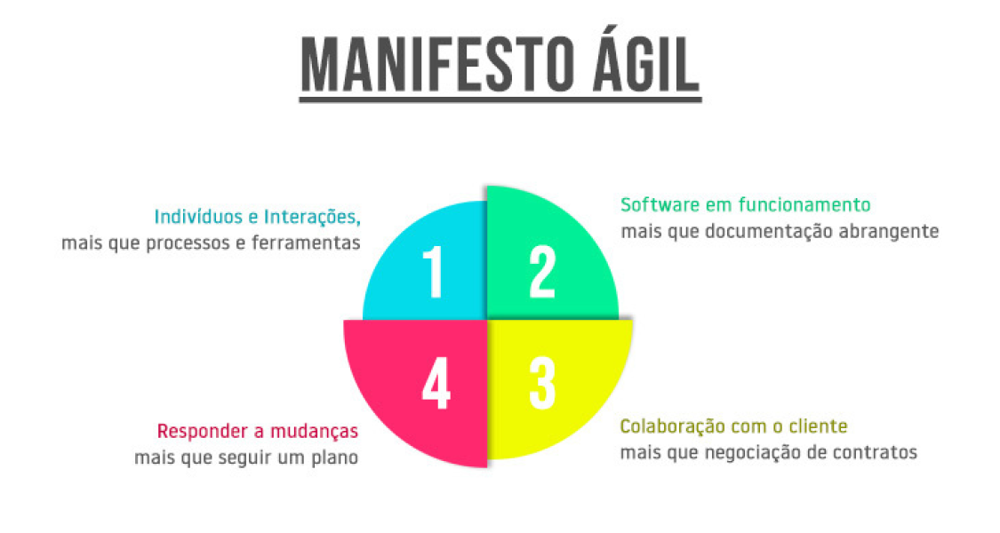
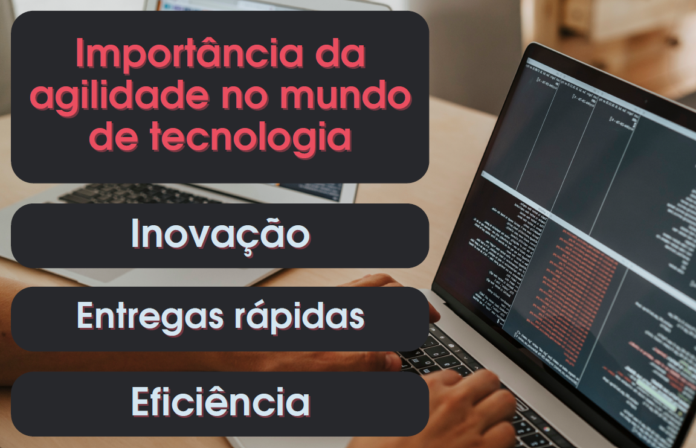
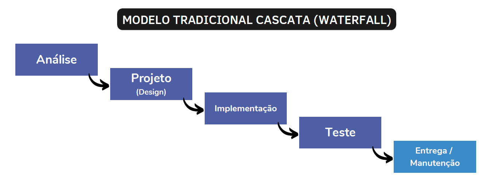
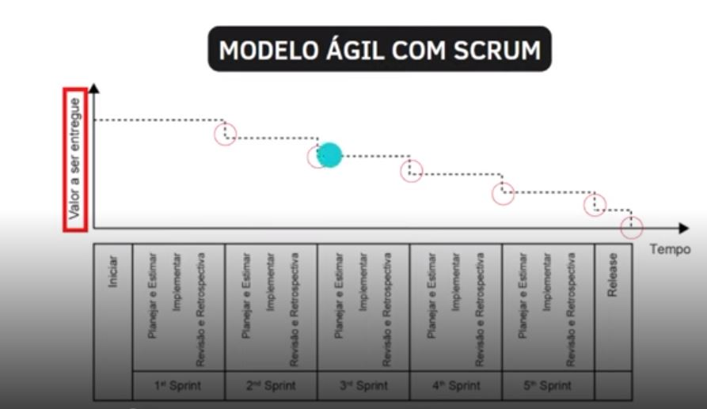
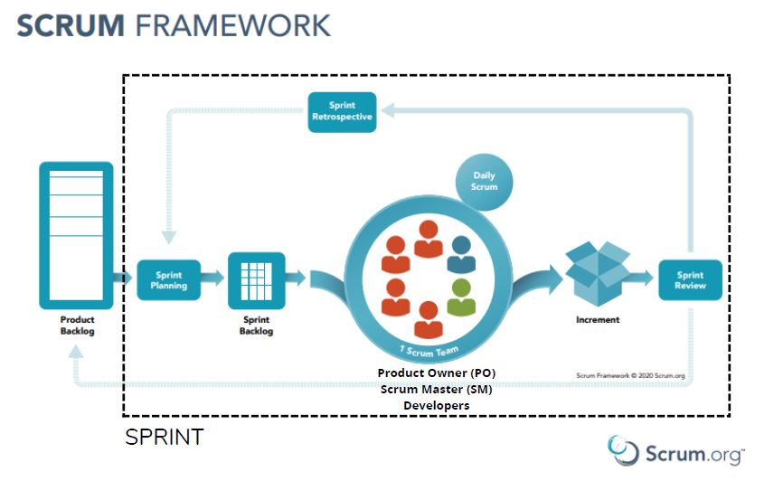
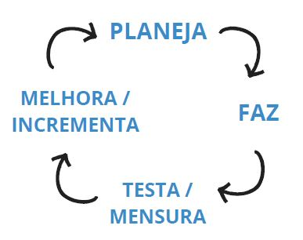
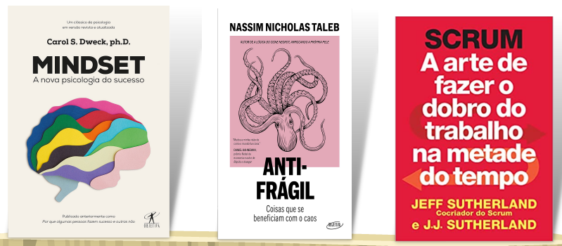
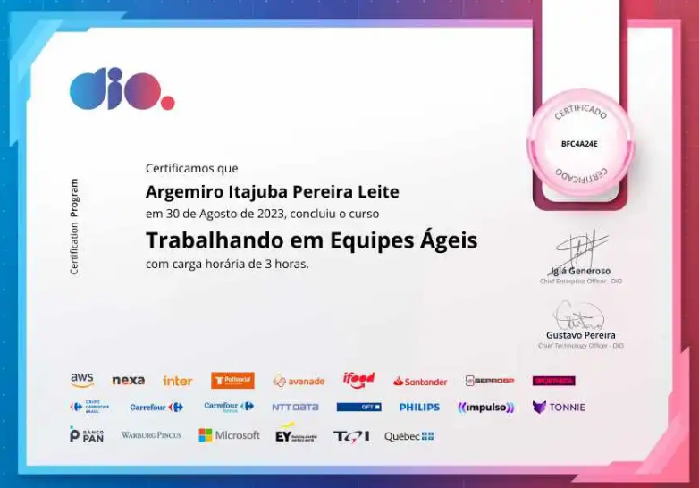

# Trabalhando em equipes ágeis
```
Bootcamp Code Update TQI Back End com Java e Kotlin
Periodo: 29/08/23 a 29/10/23 - Instrutor: Leonardo Ropelato
```
## Introdução à cultura ágil

### Objetivos

- Compreender o que é ser Ágil
- Entender os princípios da Gestão Ágil
- Conhecer os principais Métodos e Ferramentas Ágeis
- Conhecer as características de um time ágil

### Pilar

- Manifesto ágil
- Quatro valores 
- Doze princípios

### Quatro valores

1. Indivíduos e interação mais que processos e ferramentas.
2. Software funcionando mais que documentação abrangente.
3. Responder a mudnças mais que seguir um plano.
4. Colaboração com o cliente mais que negociação de contratos.



### Doze princípios ágeis

1. Nossa maior prioridade é satisfazer o cliente através da entrega contínua e adiantada de software com valor agregado.
2. Aceitar mudanças de requisitos, mesmo no fim do desenvolvimento. Processos ágeis se adequam a mudanças, para que o cliente possa tirar vantagens competitivas.
3. Entregar frequentemente software funcionando, de poucas semanas a poucos meses, com preferência à menor escala de tempo.
4. Pessoas de negócio e desenvolvedores devem trabalhar diariamente em conjunto por todo o projeto.
5. Construir projetos em torno de indivíduos motivados, dando a eles o ambiente e o suporte necessário e confiando neles para fazer o trabalho.
6. O método mais eficiente e eficaz de transmitir informações para e entre uma equipe de desenvolvimento é por meio de conversa face a face.
7. Software funcionando é a medida primária de progresso.
8. Os processos ágeis promovem desenvolvimento sustentável. Os patrocinadores, desenvolvedores e usuários devem ser capazes de manter um ritmo constante indefinidamente.
9. Contínua atenção a excelência técnica e bom design aumenta a agilidade.
10. Simplicidade: a arte de maximizar a quantidade de trabalho não realizado é essencial.
11. As melhores arquiteturas, requisitos e designs emergem de times auto-organizáveis.
12. Em intervalos regulares, a equipe reflete sobre como se tornar mais eficaz e então refina e ajusta seu comportamento de acordo.

### Caracteristicas de um time ágil

- Alinhado com o cliente e stakeholders
- Auto-organizado e Responsável
- Multidisciplinar
- Entrega valor continuamente
- Está sempre aprendendo
- Melhoria contínua
- Possui métricas e metas claras
- Unido

###  Agilidade na tecnologia

- Inovação: Melhorias contínuas. Fazer de forma diferente.
- Entregas rápidas: Fazer no menor prazo com máximo valor
- Eficiência.



### Mundo VUCA

- V Volatility (Volatilidade)
- U Uncertainty (Incerteza)
- C Complexity (Complexidade)
- A Ambiguity (Ambiguidade)


## Gerenciamento de projetos e Gestão Ágil

### Diferença entre processo e projeto

**Processo**

- recorrente e contínuo
- replicável
- repetitivo e periódico


**Projeto**

- esforço temporário
- resultado específico
- início e fim bem definidos

### Projeto Ágil e Projeto tradicional

#### Modelo tradicional cascata (Waterfall)



Características:

- Etapas seguem de forma subsequente (sem concorrência)
- Etapa anterior deve estar 100% finalizada
- Valor entregue no final do projeto

#### Modelo Ágil com Scrum



Características:

- Entregas menores ao final de cada ciclo (sprints)
- Cada ciclo engloba todas as fases do modelo tradicional
- Desenvolvimento iterativo e incremental
- A cada entrega há um feed-back
- Possibilidade de reavaliação de escopo após cada feed-back

O melhor modelo a ser adotado dependerá de cada projeto, podendo haver também o modelo híbrido que tenta aproveitar o melhor dos dois mundos.


#### O que é Gestão Ágil 

Modelo de gestão de projetos que tem as seguintes características:

- Flexível e que se adapte às mudanças
- Colaborativa e que gere transparência
- Voltada ao aprendizado
- Entrega Contínua de Valor

## Métodos e ferramentas ágeis

Dentre diversa opções, os métodos que mais se destacam são: 

- Framework Scrum
- Extreme Programming (XP)
- Kanban
- OKR

### O que é Scrum

```
"Scrum é um framework leve que ajuda pessoas, times e organizações a gerar valor por meio de soluções adaptativas para problemas complexos."
```

#### Bases do Scrum

- Empirismo: Observação. Ciclo PDCA (Plan-Do-Check-Act).
- Lean Thinking (Toyota): melhoria contínua e redução do disperdício.

#### Pilares do Scrum

- Transparência: todos os ângulos devem ser acessíveis a todos. Cultura de trabalho aberta.

- Inspeção: detetar variações ou problemas potencialmente indesejáveis. Medir-Feedback-Inspeção.

- Adaptação: ocorre quando o time Scrum aprende através da Transparência e da Inspeção.

### O Framework Scrum

É uma estrutura que define o que e porque algo tem que ser feito, mas deixa o 'como fazer' em aberto. 



### O que é XP (Extreme Programming)

É uma metodologia de desenvolvimento de software do final dos anos 90 que tem como objetivo criar sistemas com alta qualidade, com base em uma interação próxima com os clientes, testagem constante e ciclos de desenvolvimento curtos.



O que tem no XP:

- ciclos
- reuniões: momentos específicos de checagem.
- testes: muito forte na metodologia XP.
- programação em pares: pair programming.
- feedback: garante aproximação do cliente e da equipe
- flexibilidade: adaptação à mudanças.

### Kanban

É um método para definir, gerenciar e melhorar serviços que entregam trabalho de conhecimento, como serviços profissionais, atividades criativas e o design de produtos físicos e de software.

É um dos mais utilizados nas empresas devido a sua simplicidade. Foi desenvolvido pela Toyota, para solucionar um problema desperdício  relacionado à gestão de estoque.

Hoje é utilizado em outras áreas para fazer a **Gestão de Tarefas**. 

Áreas onde é usado:

- Equipes de marketing
- Prestação de serviços
- Desenvolvimento de software

Na prática é implementado através de um quadro com três colunas:

- to do ( para fazer)
- doing (fazendo)
- done (feito)

A movimentação entre essas colunas é dinâmica e instantaneamente conhecida e visualizada por todos da equipe.


### OKR (Objective Key Results)

O OKR é um método de gestão ágil que foi criado pelo ex-CEO da Intel Andrew Grove e tem como objetivo simplificar a forma de encarar os principais objetivos estratégicos de uma empresa. É usado no Google
desde 1999.

#### Objectives

Descrições qualitativas que apontam a direção a ser seguida pela empresa. Tem que ser:

- claro
- inspirador
- desafiador
- alinhado com a missão do negócio

Exemplos:

- Criar uma experiência inesquecível para o cliente em todos os pontos de contato.
- Crescer as vendas na região sul do país, dominando a região.
- Tornar-se referência nacional e autoridade absoluta na área de Educação em Tecnologia.

#### Key Results

São as metas e determinam o atingimento do objetivo na metodologia OKR.

Características das metas:

- baseadas em idicadores-chave de desempenho (KPI)
- quantitativas
- SMART: Specific - Measurable - Achievable - Relevant - Time-bound. Em português seria: específico - mensurável - alcançavel - relevante - temporal.

Ao aplicar os princípios S.M.A.R.T. ao definir os resultados-chave em um conjunto de Objetivos e Resultados-Chave (OKRs), você cria metas claras e alcançáveis que impulsionam o desempenho e o alinhamento em toda a organização.

#### Exemplo OKR

```
Objective:

Criar uma experiência inesquecível para o cliente em todos os pontos de contato.
```
Possíveis KR:

- KR1 - Integrar a base de dados dos 5 canais de atendimento
- KR2 - Contratar mais 15 atendentes e 1 gestor de comunidade
- KR3 - Alcançar um NPS de 80%

⚠️ Dicas
- Para cada Objective define-se entre 2 e 5 KR.
- Cada organização define o período de tempo da aplicação da metodologia e sua abrangência dentro da corporação.

#### Benefícios do OKR

- AGILIDADE: implementa ciclos rápidos de gestão como outras metodologias.

- COOPERAÇÃO E TRANSPARÊNCIA: todos estão envolvidos no mesmo projeto

- MONITORAMENTO CONTÍNUO: SMART e KPI são fundamentais

#### Ferramentas para Gestão Àgil

- [Trello](https://trello.com/) : Trello é um aplicativo de criação de listas baseado na web, estilo kanban, desenvolvido pela Trello Enterprise, uma subsidiária da Atlassian.

- [Notion](https://www.notion.so/) : Notion é um aplicativo da web freemium para produtividade e anotações desenvolvido pela Notion Labs Inc. Ele oferece ferramentas organizacionais, incluindo gerenciamento de tarefas, rastreamento de projetos, listas de tarefas, marcadores e muito mais.

- [Miro](https://miro.com/) : Miro é uma plataforma de colaboração online que permite que equipes trabalhem juntas de maneira virtual. Ela é conhecida por suas funcionalidades de quadro branco digital, onde os usuários podem criar, compartilhar e colaborar em projetos, ideias e planos.

- [Monday](https://monday.com/) : monday.com é uma plataforma de trabalho que ajuda equipes a colaborar, gerenciar projetos e acompanhar o progresso das tarefas. Ele oferece uma interface visual intuitiva que permite criar quadros personalizados para organizar informações, atribuir tarefas a membros da equipe, definir prazos, acompanhar o status das atividades e muito mais.

- [jira](https://www.atlassian.com/software/jira) : Jira é uma popular ferramenta de gerenciamento de projetos e problemas desenvolvida pela Atlassian. Ele é amplamente utilizado por equipes de desenvolvimento de software e outras equipes que precisam rastrear tarefas, problemas e projetos. 

- [Clickup](https://clickup.com/) : ClickUp é uma plataforma de gestão de trabalho e produtividade que oferece uma variedade de ferramentas para ajudar equipes a organizar tarefas, projetos e colaboração de maneira eficiente. Ele permite criar listas de tarefas, definir prazos, atribuir responsabilidades, acompanhar o progresso e colaborar com colegas de equipe.

- [EasyRetro](https://easyretro.io/) : Através do EasyRetro, os membros da equipe podem criar quadros virtuais nos quais eles podem adicionar cartões com feedback, ideias, elogios, preocupações e muito mais. 

- [Asana](https://asana.com/) : Asana é uma plataforma de gerenciamento de trabalho e projetos que auxilia equipes a organizar tarefas, colaborar em projetos e acompanhar o progresso.

A maioria dessas ferramentas adota o modelo **Fremium** com planos free e pagos.

#### Para saber mais

Links úteis

- [Manifesto para Desenvolvimento Ágil de Software](https://agilemanifesto.org/iso/ptbr/manifesto.html)
- [Scrum.org](https://www.scrum.org/)
- [Download - Scrum Guide](https://scrumguides.org/index.html)
- [Kanban University](https://kanban.university/)

Notícias / artigos

- [Liderança ágil - Marcelo Ciascasua](https://forbes.com.br/forbes-tech/2022/06/marcelo-ciascasua-lideranca-e-agil/)
- [Forbes - Heineken](https://forbes.com.br/forbesesg/2021/12/heineken-aplica-prototipagem-para-levar-energia-renovavel-a-bares/)

Livros



Mentoria

[Mentoria - Introdução ao Scrum e à Cultura ágil](https://www.youtube.com/watch?v=j_z2JVHgmuc "Mentoria com Leonardo Ropelato")


### Certificado



```
Disclaimer:

Todos material aqui apresentado foi gerado a partir de minhas anotações pessoais de aula durante o excelente treinamento ministrado pelo Instrutor @Leonardo Ropelato.

Proibida a reprodução e veiculação sem a ciência e autorização da DIO.
```


