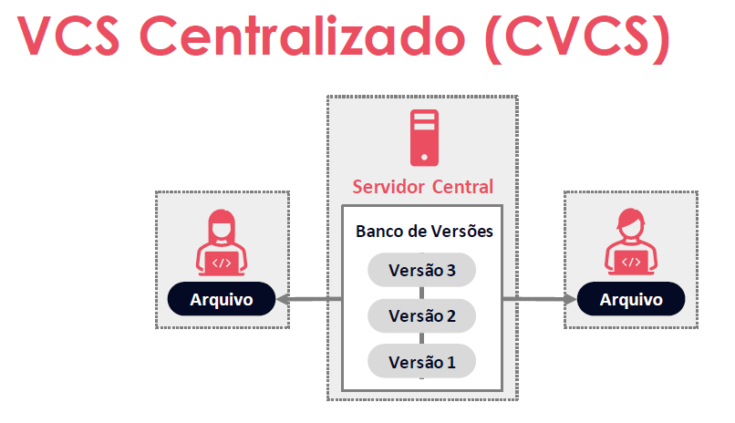
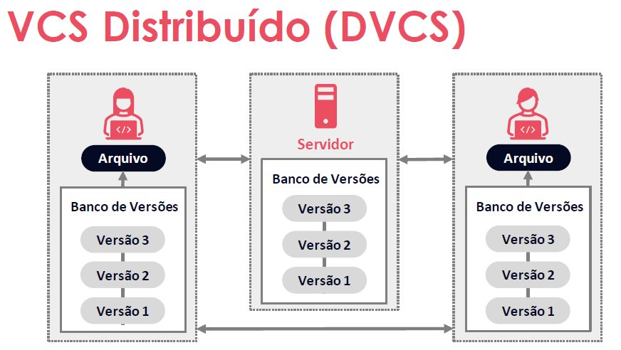
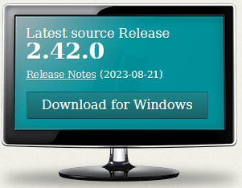
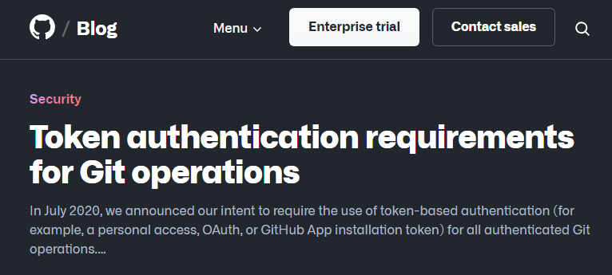
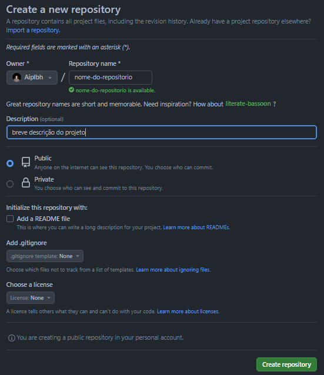
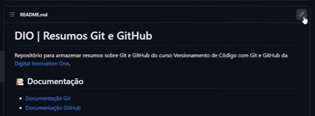
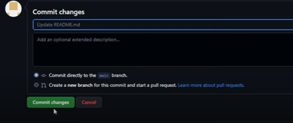

# Versionamento de código com Git e Github
```
Bootcamp Code Update TQI Back End com Java e Kotlin
Periodo: 29/08/23 a 29/10/23 - Instrutora: Elidiana Andrade @elidianaandrade
```
## Visão geral do curso e ferramentas


### Introdução ao curso

Nesse treinamento veremos:

- Visão Geral do Curso e Ferramentas
- Instalação, Configuração e Autenticação
- Primeiros Passos com
- Git e GitHub
- Dicas e Materiais de Apoio

### O que é versionamento de código

**Sistemas de Controle de Versão** são ferramentas que:

- Registram o histórico de atualizações de um arquivo
- Gerenciam quais foram as alterações, a data, autor etc
- Garantem organização, controle e segurança

#### Tipos

- CVCS - Controle de versão centralizado: CVS, Subversion



``` 
A desvantagem desse modelo está no fato de que se o servidor central ficar inoperante todo trabalho de versionamento fica comprometido.
```

- DVCS - Controle de versão dsitribuido: Git, Mercurial



``` 
Nessa arquitetura, a base de dados de versionamento do Servidor é replicada em cada computador.

Além disso essa solução (DVCS) clona o repositório completo, o que inclui o histórico de versões.

Outras características:

- Cada clone é como um backup.
- Possibilidade de trabalhar sem conexão à rede.
- Possibilita um fluxo de trabalho flexível.
```

### O que é Git

O [Git](https://git-scm.com/) é um Sistema de Controle de Versão Distribuído com as seguintes características:

- Gratuito e Open Source (Código Aberto).
- Ramificações (branching) e fusões (merging) eficientes.
- Leve e rápido.
- Documentação online: [Git Docs](https://git-scm.com/docs) e book [Git Pro](https://git-scm.com/book/en/v2)

- Download (Clique na figura)

- [](https://git-scm.com/download/win)

#### Fluxos básicos no Git

- **git clone** : clona um repositório Git existente paraum novo diretório (pasta) local.

- **git commit** : grava alterações no repositório.

- **git pull** : "puxa" as alterações do repositório remoto para o local (busca e mescla).

- **git push** : "empurra" as alterações do repositório local para o remoto.


### O que é [GitHub](https://github.com/)

Plataforma de hospedagem de código para controle de versão com Git, e colaboração.

Desenvolvido em 2008 por Chris Wanstrath J Hyett, Tom Preston Werner e Scott Chacon

Vítima de um dos maiores ataques de DDoS (ataque distribuído de negação de serviço), foi comprado pela Microsoft Corporation em 2018 por US $ 7,5 bilhões

Em seguida foi mostrado como realizar o cadastro de uma conta no Github, configuração básica e habilitação da autenticação de dois fatores que passará a ser exigência até o final de 2023.


## Instalação, configuração e autenticação


### Instalando o Git no Windows

- Acesse [https://git-scm.com/download/win](https://git-scm.com/download/win).

- Faça o download do instalador e execute. 

- Aceite a licença e clique em “Next”, e siga configurando
como desejar¹ e clicando em [Next].

- Finalize clicando em [Install] e [Finish]

```
1. Em Select Components deixe as opções Git Bash Here e Git GUI Here marcadas
```
### Instalando o Git no Linux (Ubuntu)

- Confira a documentação do [Git docs](https://git-scm.com/download/linux)
- Instale a última versão estável do Git: 

```
$ sudo add apt repository ppa:git core ppa
$ sudo apt update
$ sudo apt install git
$ git --version
```
### Configurando o Git

Abra um terminal do Git clicando com o botão direito do mouse em uma pasta do Windows.

No terminal que se abre digite: `git config`. Será mostrado várias informações sobre configurações do programa.

A configuração que nos interessa no momento é a que mostra em qual arquivo uma dada configuração será gravada, definindo também o escopo da mesma.

```
$ git config
usage: git config [<options>]

Config file location
    --global              use global config file
    --system              use system config file
    --local               use repository config file
    --worktree            use per-worktree config file
    -f, --file <file>     use given config file
    --blob <blob-id>      read config from given blob object
```

As configurações abaixo serão feitas em nível global:

```
$ git config --list
$ git config --global user.name "Nome Sobrenome"
$ git config --global user.email seuemail@email.com
$ git config --global init.defaultBranch main
```

### Autenticando via Token

O uso de tokens é indicado em várias situações quando se trabalha com serviços e APIs online, incluindo o GitHub. Aqui estão algumas situações em que o uso de tokens é recomendado:

- **Autenticação de Aplicativos e Serviços**: Quando você está desenvolvendo um aplicativo, script, blog, ou qualquer serviço que precise se conectar a uma plataforma online, como o GitHub, é recomendado o uso de tokens para autenticação. Isso permite que o serviço prove sua identidade de forma segura.

- **Acesso a APIs**: Ao usar APIs de terceiros, como a API do GitHub, você geralmente precisa de um token para autenticar suas solicitações. Isso é essencial para garantir que apenas usuários autorizados tenham acesso aos dados e recursos da API.

- **Integração com Plataformas Externas**: Se você estiver integrando seu aplicativo ou serviço com outras plataformas online, como redes sociais, sistemas de pagamento, ou serviços de armazenamento em nuvem, é provável que precise de tokens para autenticação e autorização.

- **Controle de Acesso Granular**: Tokens podem ser usados para conceder acesso granular a recursos específicos. No GitHub, por exemplo, você pode configurar permissões precisas para um token de acesso pessoal, controlando exatamente o que o token pode fazer, como ler ou escrever em repositórios específicos.

- **Segurança Melhorada**: Em comparação com senhas, tokens geralmente são mais seguros porque podem ser facilmente revogados e gerenciados em caso de comprometimento. Além disso, eles podem ser configurados para expirar após um determinado período de tempo.

- **Automação e Integração Contínua**: Ao automatizar tarefas, como implantações de código ou coleta de métricas de repositórios, é comum usar tokens para garantir que essas ações sejam executadas em nome do usuário ou serviço correto.

### Uso de tokens obrigatório

Desde 2021 a plataforma GitHub deixou de aceitar, por motivos de segurança, o username / senha como autenticador de acesso aos repositórios e recursos.



### Vantagens do Token em relação à senha
Podemos destacar as vantagens do uso de tokens em relação à autenticação por senha, considerando os tokens são: 

- **Únicos**: Tokens são específicos para o GitHub e podem ser gerados para cada uso ou dispositivo separadamente. Isso significa que você pode criar tokens diferentes para finalidades diferentes ou para diferentes dispositivos, proporcionando maior controle sobre o acesso.

- **Revogáveis**: Os tokens podem ser revogados individualmente a qualquer momento, sem a necessidade de atualizar as credenciais não afetadas. Isso significa que, se você suspeitar de qualquer atividade suspeita ou se um token não for mais necessário, você pode simplesmente revogá-lo sem afetar outros tokens ou credenciais.

- **Limitados**: Tokens podem ter escopos limitados, ou seja, você pode configurá-los para permitir apenas o acesso necessário para um caso de uso específico. Isso reduz o risco de autorizações excessivas e potencialmente perigosas.

- **Aleatórios**: Tokens não estão sujeitos aos tipos de tentativas de força bruta ou uso de dicionário que senhas mais simples (que você precisa lembrar ou inserir regularmente) podem enfrentar. Isso torna os tokens mais seguros, pois são difíceis de adivinhar ou quebrar.

### Gerando um token

- Para gerar um Token, acesse sua conta no GitHub, e no menu superior direito clique em Settings > Developer settings > Personal acces tokens > Tokens classic > clicar no botão [Generate new token] > Generate new token (classic).

### Armazenando Credenciais

Alternativamente para evitar de ficar gerando sempre um novo token é possível armazenar suas credenciais para reduzir o número de vezes que você deve digitar seu nome de usuário ou senha.

- Salvando no cache:

```
$ git config --global credential.helper cache
```

- Ou permanentemente:

```
$ git config --global credential.helper store
```

[Veja mais na doc](https://git-scm.com/book/pt-br/v2/Git-Tools-Credential-Storage)


### Autenticando via Chave SSH

Para adicionar uma Chave SSH, acesse sua conta no GitHub, e no menu superior direito clique em: 
- Settings > SSH and GPG keys > New SSH key

## Primeiros passos com Git e GitHub

### Criando e clonando repositórios

Existem duas formas de obter um repositório Git na sua máquina:

- Transformando um diretório local que não está sob controle de versão, num repositório Git.

- Clonando um repositório Git existente

#### 1. Criando um Repositório Local

- Acesse a pasta que deseja transformar em um repositório Git pelo terminal ou clique no atalho em 'Git Bash Here' (botão direito do mouse).

- Inicialize um repositório Git no diretório escolhido enviando o seguinte comando:

```
$ git init
```

- Conecte o repositório local com o repositório remoto:

```
$ git remote add origin https://github.com/username/nome-do-repositorio.git
```

#### 2. Clonando um Repositório

Para clonar um repositório no Git acesse seu repositório no
GitHub e siga os próximos passos:

- Cique em  [Code]  e copie o código HTTPS ou SSH (a depender de como autenticou sua conta) do repositório no GitHub.

- Abra o GitBash (botão direito do mouse) insira o comando git clone e cole o conteúdo copiado para cloná-lo:

```
$ git clone https://github.com/username/nome-do-repositorio
```

### Criando um Repositório Remoto

Acesse a sua conta do GitHub, clique no '+' no canto superior direito, e em 'New repository':

- Insira um nome (obrigatório) e uma descrição (opcional).
- Coloque, opcionalmente, uma breve descrição sobre o projeto.
- Defina se o acesso é público ou privado.
- Escolha como deseja inicializar seu repositório com um arquivo README.md e diretório gitignore (se quiser vazio, deixe as opções desmarcadas)
- Clique em [Create repository]



---

### Salvando Alterações no Repositório Local

#### Criando um diretório de exemplo

Na sua pasta de projetos crie uma pasta para armazenar as alterações dos resumos das aulas que você irá atualizando.

Para exemplificar, foi usado o diretório:
```
C:\Users\Public\Aipl\Bootcamps\DIO-TQI-Java-Kotlin-Backend\

~ $ mkdir git-github
~ $ cd git-github
~ $ git init
~ $ git status
```
O comando `git status` mostra o status da nossa árvore de trabalho e também da área de preparação conhecida como `stagging area`.

---

#### Trabalhando com arquivos Markdown

Usaremos como referência a documentação do [GitHub Docs](https://docs.github.com/pt/get-started/writing-on-github) "Como escrever no GitHub".

Alternativamente, para criarmos os arquivos markdown usaremos o site [Readme.so](https://readme.so/pt/editor)

[Links úteis - Inserir emojis](https://github.com/ikatyang/emoji-cheat-sheet/blob/master/README.md#people--body)

---

#### Como criar um commit

Após alterações importantes no seu projeto (código) adicione o conteúdo novo que desejar e para que essas mudanças sejam contempladas no próximo commit, envie o comando:
```
$ git add .
```
Em seguida envie um commit, adicionando uma mensagem descritiva:

```
$ git commit -m "mensagem ex.: alteração no arquivo tal"
```
Isso informa ao Git que as alterações feitas já foram contabilizadas e estão prontas para serem carregadas no repositório remoto. Para verificar o status das alterações use:

```
$ git status
```

Para verificar o log de alterações:

```
$ git log
```
 
---
#### Desfazendo Alterações no Repositório Local

- Caso tenha dado um git init em um diretório errado, basta remover a pasta oculta .git que é criada. Para isso use o comando do Bash:

```
$ rm -rf .git
```
- Para recuperar um arquivo que tenha sido modificado indevidamente, recuperando a versão anterior, basta dar o comando:

```
$ git restore [nome-do-arquivo-alterado indevidamente]
```

- Caso deseje alterar a mensagem descritiva do **último** `commit` envie o comando: 

```
$ git commit --amend -m "nova mensagem"
```
---
Para 'desfazer' um commit envie o comando: `git reset`

```
$ git log  [copie o código do hash do commit]
$ git reset --[tipo: soft | mixed | hard] [código-hash-do-commit]
```
Quando você executa `git reset --soft`, ele faz o seguinte:

Move a branch (ramificação) atual para o commit especificado, que é geralmente especificado como um argumento após o comando. 

Desfaz os commits que vieram depois do commit especificado, mas mantém as mudanças dos commits desfeitos como alterações não confirmadas em seu diretório de trabalho. Essas alterações não confirmadas são mostradas como modificações pendentes quando você executa git status.

Também mantém as mudanças dos commits desfeitos no índice (área de preparação). Isso significa que as alterações desfeitas ainda estão preparadas para commit, e você pode confirmá-las novamente após revisá-las ou ajustá-las conforme necessário.

```
$ git reset --soft [código-hash-do-commit]
```

---

O próximo comando de reset é o tipo ``` --mixed ```. Esse já é o padrão do comando reset e o parâmetro poderia ser até omitido.

Esse tipo de `git reset` move a branch (ramificação) atual para o commit especificado, que é geralmente especificado como um argumento após o comando.

Ele também desfaz os commits que vieram depois do commit especificado, mas mantém as mudanças dos commits desfeitos como alterações não confirmadas em seu diretório de trabalho. Essas alterações não confirmadas são mostradas como modificações pendentes quando você executa git status.

Ainda remove as mudanças dos commits desfeitos do índice (área de preparação). Isso significa que você terá que adicionar novamente essas mudanças ao índice, selecionando os arquivos que deseja incluir no próximo commit usando git add

```
$ git reset --mixed
```
---

O comando ``git reset --hard``  é uma opção drástica que desfaz commits e elimina todas as alterações não confirmadas no diretório de trabalho. Use-o com cautela, pois as alterações perdidas não podem ser recuperadas facilmente após sua execução. 

É útil quando você deseja reverter completamente o repositório para um estado anterior e não se importa em perder as alterações não confirmadas.

```
$ git reset --hard [hash-do-commit]
```
---
Para um log detalhado envie o comando:

```
$ git reflog
```
---
#### Conectando ao servidor remoto

```
$ git remote add origin [url-do-repositorio-remoto]
```
---
#### Enviando as alterações locais já comitadas para o remoto (origin)

O parâmetro -u indica para fazer um upstream do nosso branch local main para o servidor remoto (origin) na branch main.
```
$ git push -u origin main
```
---

#### Efetuando alterações no repositório remoto (origin)

Usando o ícone de edição (pequeno lápis) pode-se alterar arquivos no servidor remoto.



Também é possível editar teclando . (ponto). Isso vai carregar um aplicativo semelhante ao Visual Studio Code.

Após feitas as alterações será apresentado a opção de se fazer o comite das alterações no botão [Commit changes]. 



Observe que essas alterações não são propagadas para o nosso repositório local.

Para isso devemos voltar ao nosso terminal do GitBash local e digitar

```
$ git pull
```

#### Trabalhando com branches
###### Criando, mesclando, deletando e tratando conflitos

De maneira simplista, uma Branch (em tradução, “Ramo”), é uma ramificação do seu projeto.

- É um ponteiro móvel para um commit no histórico do repositório

- Quando você cria uma nova Branch a partir de outra existente, a nova se inicia apontando para o mesmo commit da Branch que estava quando foi criada.

#### Trocar de `branch` e criar uma nova

```
$ git checkout -b [nova-branch-filha]
```
---

#### Deletar uma branch

``` 
$ git branch -d [nome-da-branch-filha]
```
---
#### Ver o último **commit** de cada `branch`

``` 
$ git branch -v
```
---
#### Mesclar uma branch com a branch main

```bash
~/git-github(main)
$ git merge [nome-da-branch-filha]
```
---
#### Listar as branches existentes

```
$ git branch
```
Após fazer um `git merge` com a branch `main`, pode-se deletar a branch filha co o comando `git branch -d [nome-branch-filha]` como mostrado acima.

⚠️ Existem convenções para nomear as branches, bem como orientações para as mensagens de commit.

⚠️ Observe que a branch filha só existe no repositório local. Caso se deseje que um branch filha seja criada no repositório remoto (origin) todas as etapas acima devem ser executadas lá.

#### Tratamento de conflitos - Conflito de merge

Ocorre quando se tem alterações concorrentes. 

#### Comandos úteis no dia a dia

Pode ocorrer que você deseje buscar alterações feitas no repositório remoto (origin/main) sem fazer um merge.

Ao invés de usar o `git pull` pode-se usar:

```
$ git fetch origin main 
```

(O `git pull` executa um `git fetch + git merge`).

Para verificar os arquivos diferentes entre o seu repositório local e o remoto use:

```
$ git diff
```

#### Clonar uma branch filha a partir do repositório remoto

```
$ git clone [url-do-repositório-remoto] --branch [branch-filha] --single-branch
```
---
#### Para arquivar temporariamente uma branch em se está trabalhando

```
$ git stash 
```
Após criar outra branch, se desejar voltar à branch arquivada, use:

```
$ git stash list
$ git stash pop
```


## Dicas e materias de apoio

Consulte o materia da Instrutora @elidianaandrade para continuedade do seus estudos sobre versionamento e repositórios de código.

[GitHub da Elidiana Andrade sobre Versionamento de código](https://github.com/elidianaandrade/dio-curso-git-github/)


## Certificado


```
Disclaimer:

Todo o material aqui apresentado foi gerado a partir de minhas anotações de aula durante o excelente
treinamento ministrado  pela Instrutora Elidiana Andrade @elidianaandrade . Proibida a reprodução e veiculação
sem a ciência e autorização da DIO.
```
